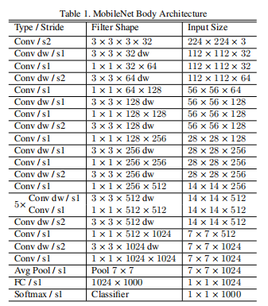

## 各层 FLOPs 和参数量 paras 的计算
### 参数量
(K*K*Cin)*Cout + Cout  = (K*K*Cin+1)*Cout 
### 计算量
计算量在参数量的基础上再乘以 输出特征图的大小，因为输出的每个点对应参数的计算
(K*K*Cin+1)*Cout*H*W
### 卷积后尺寸的计算


## BN操作回顾

## 感受野大小的计算
*type* | *size* | *stride* |
:---: | :---: |:--- |
conv1 | 3 | 1 |
pool1 | 3 | 2 |
conv2 | 3 | 1 |
pool2 | 2 | 2 |
conv3 | 3 | 1 |
conv4 | 3 | 1 |
pool3 | 2 | 2 |

从pool3算起，其一个点对应2 * 2，那么conv4的输出为2 * 2的话，conv4的输入为4 * 4，以此类推：
conv3为 6 * 6<br>
pool2为 12 * 12<br>
conv2为 14 * 14<br>
pool1为 28 * 28<br>
conv1为 30 * 30<br>

RF = 1<br>
for layer from (down to top):<br>
&nbsp;&nbsp;&nbsp;&nbsp;RF = (RF-1)*stride + fsize

## CV中的卷积操作是互相关还是卷积
卷积层后面连接的是池化层， 也就是说把卷积结果得到的矩阵中，
选取矩阵中数值最大的元素作为保留，矩阵中其余元素一律删除。
卷积结果中的最大值 与 互相关结果矩阵中的最大值是一样的，
CNN中使用卷积或互相关，贡献是一致的，都是获取像素最大的那个值，
因此可以使用卷积，也可以使用互相关， 但是为了代码的高效，直接使用“互相关”即可。

## batch size 和 learning rate 的关系
1. 增加batch size会使得梯度更准确，但也会导致variance变小，可能会使模型陷入局部最优；
2. 因此增大batch size通常要增大learning rate，比如batch size增大m倍，lr增大m倍或者sqrt(m)倍，但并不固定；

## 类别不均衡
1. 重采样 一般提升低频类别
2. 重加权 如Focalloss
因此可以通过设定a的值（一般而言假如1这个类的样本数比-1这个类的样本数多很多，那么a会取0到0.5来增加-1这个类的样本的权重）来控制正负样本对总的loss的共享权重。
   

   
显然前面的公式3虽然可以控制正负样本的权重，但是没法控制容易分类和难分类样本的权重，于是就有了focal loss：


这里介绍下focal loss的两个重要性质：1、当一个样本被分错的时候，pt是很小的（请结合公式2，比如当y=1时，p要小于0.5才是错分类，此时pt就比较小，反之亦然），因此调制系数就趋于1，也就是说相比原来的loss是没有什么大的改变的。当pt趋于1的时候（此时分类正确而且是易分类样本），调制系数趋于0，也就是对于总的loss的贡献很小。2、当γ=0的时候，focal loss就是传统的交叉熵损失，当γ增加的时候，调制系数也会增加。
focal loss的两个性质算是核心，其实就是用一个合适的函数去度量难分类和易分类样本对总的损失的贡献。
作者在实验中采用的是公式5的focal loss（结合了公式3和公式4，这样既能调整正负样本的权重，又能控制难易分类样本的权重）：


一般而言当γ增加的时候，a需要减小一点。（实验中γ=2，a=0.25的效果最好）

## 迁移学习都有哪些方式，怎么在网络训练中使用
1. 预训练模型方法  固定部分权值，微调更新末端权值

## 权重初始化方法有哪些
1. 把w初始化为0
2. 对w随机初始化（正态分布）
3. Xavier initialization（适用于sigmod,tanh函数）
   
   
4. He initialization（MSRA 适用于relu激活函数）
   
   

## 计算机视觉中的注意力机制
参考：https://zhuanlan.zhihu.com/p/146130215

attention机制可以它认为是一种资源分配的机制，可以理解为对于原本平均分配的资源根据attention对象的重要程度重新分配资源，重要的单位就多分一点，不重要或者不好的单位就少分一点，在深度神经网络的结构设计中，attention所要分配的资源基本上就是权重了。

视觉注意力分为几种，核心思想是基于原有的数据找到其之间的关联性，然后突出其某些重要特征，有通道注意力，像素注意力，多阶注意力等，也有把NLP中的自注意力引入。

## onehot 编码可能会遇到的问题
onehot主要针对无序分类编码进行转换，常用的距离或相似度的计算都是在欧式空间的相似度计算，比如计算余弦相似性，就是基于欧式空间。将离散型特征使用one-hot编码，确实会让特征之间的距离计算更加合理。
比如，有一个离散型特征，代表工作类型，该离散型特征，共有三个取值，不使用one-hot编码，其表示分别是x_1 = 1, x_2 = 2, x_3 = 3。两个工作之间的距离是，d(x_1, x_2)= 1, d(x_2, x_3) = 1, d(x_1, x_3) = 2。那么x_1和x_3工作之间就越不相似吗？显然这样的表示，计算出来的特征的距离是不合理。那如果使用one-hot编码，则得到x_1 = (1, 0, 0), x_2 = (0, 1, 0), x_3 = (0, 0, 1)，那么两个工作之间的距离就都是sqrt(2).即每两个工作之间的距离是一样的，显得更合理。

onehot编码带来的特征维度不同：

例如有5个特征，其中四个连续一个离散，这种情况下用onehot编码，相当于该离散特征占了4维。

onehot解决的是从特征角度降低问题非线性的问题。虽然说连续特征离散后维度变高，可以认为讲隐藏在连续特征中的信息为模型学习摊开了，模型可利用的有效信息量更大。可以使用条件熵分析下就可以得到结论。gbdt类的模型的学习过程就是不断找到具有最大收益的特征并进一步找到这个特征在样本上的分裂值，所以它需要单个特征的variation要大一些，由于在树上不同的分裂点可能会对同一个特征的不同值做分裂，所以即使这个特征与label表现出非线性关系，他也能学到知识。反之，如果经过onehot后的特征交给模型学习，特征在整个样本集上就两个取值，模型学到的信息较少。

One hot编码维度过高解决方法：
1. 根据类别特征的意义进行合并（分桶）
2. 将类别按频次排序，频次特别低的一部分合并
3. 特征哈希
4. PCA降维
5. 按照该特征对应目标值进行合并
6. 使用每个分类对应目标变量均值+偏差，或出现频数代替

## 分类问题有哪些评价指标？每种的适用场景
1. Accuracy  (Area Under Curve)
2. precision
3. recall
4. F1 score
5. ROC
6. PR （Precision-Recall）曲线
   1. PR曲线正常是递减
   2. 若递增则可能出现困难样本或错误标签

## 为什么要用 F1 score
若只用准确率来表示癌症病人的预测，模型只输出健康，也能达到很高的准确率，这显示不合理。
precision = TP / (TP + FP)<br>
recall = TP / (TP + FN)<br>
F1 = 2 * precision * recall / (precision + recall)

## L1 正则化与 L2 正则化的区别
正则化：为了限制模型的参数，防止模型过拟合而加在损失函数后面的一项。

L1正则化：各个参数的绝对值之和，能够产生稀疏矩阵。 因为最优的参数值很大概率出现在坐标轴上，这样就会导致某一维的权重为0 ，产生稀疏权重矩阵<br>
L2正则化：各个参数的平方和。能够使各个参数趋于0.

1. 为什么参数越小代表模型越简单？
　　越是复杂的模型，越是尝试对所有样本进行拟合，包括异常点。这就会造成在较小的区间中产生较大的波动，这个较大的波动也会反映在这个区间的导数比较大。
　　只有越大的参数才可能产生较大的导数。因此参数越小，模型就越简单。

2. 实现参数的稀疏有什么好处？
　　因为参数的稀疏，在一定程度上实现了特征的选择。一般而言，大部分特征对模型是没有贡献的。这些没有用的特征虽然可以减少训练集上的误差，但是对测试集的样本，反而会产生干扰。稀疏参数的引入，可以将那些无用的特征的权重置为0.

## CNN分类网络的演变脉络
参考：https://www.cnblogs.com/lyp1010/p/12562271.html

## ResNet 流行的原因
1. 通过引入残差模块，解决网络退化的问题，使得网络可以更深，学习到更好的表示
2. 梯度增大，快速收敛，加快训练速度。

ResNet_v2 与 v1 的最大区别就是 v2 的 BN 和 ReLU 是在卷积之前使用的，好处：

1. 反向传播基本符合假设，信息传递无阻碍；
2. BN 层作为 pre-activation，起到了正则化的作用

## Inception v1-v4的区别与改进


v1:多个不同size的卷积核能够增强网络的适应能力

v2:学习了VGG使用两个3*3的卷积代替5*5的大卷积，在降低参数的同时建立了更多的非线性变换，使得CNN对特征的学习能力更强。

v3:

## MobileNet，ShuffleNet
1. mobilenet

2. shufflenet
   <br>shuffle-net 这个网络模型，是利用了 group 卷积的概念，与 depth-wise 有点像，只不过，depth-wise 是 feature map 一 一对应的，而 group 卷积是将每个卷积层的 feature map 分成几个组，每个组之间没有交叉，不过组内的 feature map 做卷积的时候和常规的卷积运算是一样的，所以 group 卷积的复杂度应该是介于常规卷积核 depth-wise 卷积之间的，shuffle-net 的创新之处在于，group 卷积之后，为了增加组与组之间的 feature map的通信，提出了一个 shuffle channel 的技术，就是将 group 卷积之后 feature map 打乱，乱序连接到下一层，如下图所示：

   
## FCN 和 UNET
1. FCN
   + 全卷积 区别于分类网络的全连接
   + 上采样 为了与标签一一对应进行训练
   + 跳跃连接 将浅层的位置信息和深层的语义信息结合起来，得到更佳鲁棒的结果
   
2. UNET
   + U型结构 编码器-解码器结构 即将图像->高语义feature map的过程看成编码器，高语义->像素级别的分类score map的过程看作解码器）进行了加卷积加深处理，FCN只是单纯的进行了上采样。
   + Skip connection：两者都用了这样的结构
   + 联合：在FCN中，Skip connection的联合是通过对应像素的求和，而U-Net则是对其的channel的concat过程。
   

## 兩阶段目标检测网络的发展脉络及各自的贡献与特点
参考：https://blog.csdn.net/qq_38144185/article/details/115699848
1. RCNN
   + 候选框 + SVM
   + 首次使用CNN提取特征代替手工HOG，SIFT特征。
2. SPP-net
   + 进行一次CNN操作，在特征图上提取候选框
   + 进行金字塔池化，得到特征向量
3. Fast-RCNN
   + 添加ROI pooling
   + 使用softmax
   + 多任务损失函数（分类+回归）
4. Faster-RCNN
   + 提出RPN生成候选框，提出了anchor
   + RPN和检测共享特征
   

## 解释 ROI Pooling 和 ROI Align 的区别
都是将候选框池化到固定尺寸
1. ROI Pooling
   + 使用两次量化操作进行池化：第一次如665/32 x 665/32 = 20.78 x 20.78   20 /7 x 20/7 = 2.86 x 2.86
2. ROI Align
   + 使用线性插值进行池化
   
## Cascade R-CNN
该网络是针对两阶段算法产生候选框相关问题进行优化
1. mismatch

## FPN
处理目标检测多尺度问题，尤其是小目标检测，低层特征语义信息少，位置信息准确，高层特征语义丰富，位置信息粗糙。
1. 在多个尺度分辨率上的输出结果
2. 不同分辨率的特征图融合后输出

## 目标检测回顾总结
参考：https://blog.csdn.net/qq_36561737/article/details/115711354

## concat 和 add 的区别
1. concat 通道拼接  增加了特征数
2. add 通道融合相加  每个特征图的信息增加了

## 模型压缩
1. 剪枝：每层去掉不重要（值较小）的参数
2. 量化：float32 转 float8
3. 权重共享：参数聚类
4. 模型蒸馏：使用大模型的学到的知识训练小模型，从而让小模型具有大模型的泛化能力

## RNN && LSTM
參考：https://gitee.com/keyXR/CV_interviews_Q-A/blob/master/%E8%AE%A1%E7%AE%97%E6%9C%BA%E8%A7%86%E8%A7%89/46_LSTM%E4%BB%8B%E7%BB%8D%E7%90%86%E8%A7%A3.md


## mobilenet系列
1. v1
   + v1结构
     
     
   + 使用深度可分离卷积，是计算量降低至1/8 ~ 1/9.
   + 使用relu6 = min(max(0,x),6) 这个激活函数在float16/int8的嵌入式设备中效果很好，能较好地保持网络的鲁棒性。
   + 相比普通的卷积，有了更过的relu6激活函数，使得拥有更多的线性变化，泛化能力更强
2. v2
   
   + v2结构
     
     <br>
     
   + 借鉴resnet使用残差， resnet是压缩-卷积-扩张，目的是为了减少计算量
   + v2是“扩张-卷积-压缩”，由于mobile参数少，提取的特征信息少，扩张是为了提取更多的特征，另一方面是分组卷积无法扩张通道。
     
   + 残差模块中的最后一个relu替换成线性激活：高维信息变换回低维信息时，相当于做了一次特征压缩，会损失一部分信息，而再进过relu后，损失的部分就更加大了。作者为了这个问题，就将ReLU替换成线性激活函数。
   
3. v3
   + v3结构
     
     <br>
     
   + 使用NAS搜索结构
   + 输入输出改进减少计算量
     
   + h-swish：Swish函数优于relu，可以显著提高神经网络的精度。但由于嵌入式设备计算sigmoid是会耗费相当大的计算资源的，因此作者提出了h-swish作为激活函数。且随着网络的加深，非线性激活函数的成本也会随之减少。所以，只有在较深的层使用h-switch才能获得更大的优势。<br>
     
     h-swish的产生过程如下：
     * Swish函数可以看做是介于线性函数与ReLU函数之间的平滑函数<br>
      
     * 将swish函数近似化。sigmoid函数替换为它的分段线性硬模拟，然后再乘以x代替swish。<br>
      
   + 引入SE结构：Squeeze-and-Excitation Networks，SE模块是一种轻量级的通道注意力模块，能够让网络模型对特征进行校准的机制，使得有效的权重大，无效或效果小的权重小的效果。
   MobileNetV3的SE模块被运用在线性瓶颈结构最后一层上，代替V2中最后的逐点卷积，改为先进行SE操作再逐点卷积。这样保持了网络结构每层的输入和输出，仅在中间做处理。
     
   
## 卷积的方式有哪些
1. 普通1*1的卷积的作用
   * 改变通道数量，如resnet降低通道数，mobilenetv2增加通道数
   * 相比3*3减少计算量
   * 跨通道的信息组合,并增加了非线性特征
2. 深度可分离卷积
   + 先3*3深度卷积
   + 再1*1可分离卷积
3. 转置卷积
   + 用于特征图的上采样
4. 空洞卷积
   诞生在图像分割领域，为了增大感受野
   + 指数级增长感受野
   + 所谓空洞就是在原图上做采样。采样的频率是根据rate参数来设置的，当rate为1时候，就是原图不丢失任何信息采样，此时卷积操作就是标准的卷积操作，当rate>1，比如2的时候，就是在原图上每隔一（rate-1）个像素采样
   + 在语义分割任务中，当它与双线性插值一起使用时，可以替代转置卷积
5. 可变形卷积
   + 对卷积核的每个位置增加一个偏移量，使其具有自适应性，一定程度上增大了感受野
   + 来提高对形变的建模能力
   + 很多人可能以为deformable conv学习的是可变形的kernel，其实不是不是不是！本文并不是对kernel学习offset而是对feature的每个位置学习一个offset。

## SSD回顾
详情查看[SSD](./paper/SSD.md)

## 不同框架函数对比
*pytorch* | *mindspore*|
:---: | :---: |
forward | construct |
linear | dense |
view | flatten |
1. Tensorflow
    + tf.get_variable,如果你定义的变量名称在之前已被定义过，则TensorFlow 会引发异常。可使用tf.get_variable( ) 函数代替tf.Variable( )。如果变量存在，函数tf.get_variable( ) 会返回现有的变量。如果变量不存在，会根据给定形状和初始值创建变量。
    + tf.scatter_sub,将稀疏更新减去一个变量引用。
    
    + tf.gather,根据索引从参数轴上收集切片
    
    + tf.cast,张量数据类型转换


## 最大池化可以去掉吗

在上述模型C的基础上：
+ 第1列：去掉所有max-pool，并把前面一层conv的stride变为2。
+ 第3列，max-pool 变成 步长为2的conv +ReLU
+ 第2列：保留max-pool，并让参数量和第3列一样
+ 第3列和第2列的（learnable）参数量一样，但第3列flops变少. 且实验发现精度变高。

## CRNN运行数据
paddleOCR中运行数据
1. rnn输出[16,80,512] batchsize是16，80是序列长度，512是特征向量长度
2. CTChead输出[16,80,6625] 6625是字典字符数量

## Resnet系列
1. v1
    + 深层的网络不应该更差，引入恒等映射残差的思想
    + 特征复用，加快收敛
    + 网络可以更深，性能更好
2. v1.5
    + 更深的网络并不能带来更好的提升，引入特征图宽度（通道数）
    + 更多的参数会冗余，加入dropout
    + BRC比CBR更快，更好
3. v2
    + 网络极深情况下也会遇到优化问题，引入BRC
    + relu作为残差分支结尾会非负，影响特征表达
    + addition之后不再改变信息分布
4. ResnetXt
    + vgg的堆叠思想和Inception的增加网络宽度的思想
5. DenseNet
    + 既然shortcut有效那就多加点
    + 浅层的网络对后面的每一层都加入shortcut
   
## NMS 实现
```python
# python3
import numpy as np

def py_nms(dets, thresh):
    """Pure Python NMS baseline."""
    #x1、y1、x2、y2、以及score赋值
    x1 = dets[:, 0]
    y1 = dets[:, 1]
    x2 = dets[:, 2]
    y2 = dets[:, 3]
    scores = dets[:, 4]

    #每一个候选框的面积
    areas = (x2 - x1 + 1) * (y2 - y1 + 1)
    #order是按照score降序排序的
    order = scores.argsort()[::-1]

    keep = []
    while order.size > 0:
        i = order[0]
        keep.append(i)
        #计算当前概率最大矩形框与其他矩形框的相交框的坐标，会用到numpy的broadcast机制，得到的是向量
        xx1 = np.maximum(x1[i], x1[order[1:]])
        yy1 = np.maximum(y1[i], y1[order[1:]])
        xx2 = np.minimum(x2[i], x2[order[1:]])
        yy2 = np.minimum(y2[i], y2[order[1:]])

        #计算相交框的面积,注意矩形框不相交时w或h算出来会是负数，用0代替
        w = np.maximum(0.0, xx2 - xx1 + 1)
        h = np.maximum(0.0, yy2 - yy1 + 1)
        inter = w * h
        #计算重叠度IOU：重叠面积/（面积1+面积2-重叠面积）
        ovr = inter / (areas[i] + areas[order[1:]] - inter)

        #找到重叠度不高于阈值的矩形框索引
        inds = np.where(ovr <= thresh)[0]
        #将order序列更新，由于前面得到的矩形框索引要比矩形框在原order序列中的索引小1，所以要把这个1加回来
        order = order[inds + 1]
    return keep

# test
if __name__ == "__main__":
    dets = np.array([[30, 20, 230, 200, 1], 
                     [50, 50, 260, 220, 0.9],
                     [210, 30, 420, 5, 0.8],
                     [430, 280, 460, 360, 0.7]])
    thresh = 0.35
    keep_dets = py_nms(dets, thresh)
    print(keep_dets)
    print(dets[keep_dets])
```
### [CrossEntropyLoss 计算步骤](./code/Loss.py)
1. softmax计算，使其概率和为1
2. log计算，输入域为(0,1)，值域为（-&，0）
3. 取对应标签log值的相反数，变负为正。取一个batchsize的平均数。

### 梯度消失与爆炸
由于链式求导法则，对某一层的权值求导，相当于各层权值与激活函数导数的积。大于1连乘便爆炸，小于1连乘便消失
1. 激活函数改成relu 可解决
2. resnet 相当于导数加1，解决梯度消失
3. BN 对权值进行归一化防止过大或过小

### 卷积手写实现
```python
import numpy as np


def conv_naive(x, out_c, ksize, padding=0, stride=1):
    # x = [b, h, w, in_c]
    b, h, w, in_c = x.shape
    kernel = np.random.rand(ksize, ksize, in_c, out_c)
    if padding > 0:
        pad_x = np.zeros((b, h+2*padding, w+2*padding, in_c))
        pad_x[:,padding:-padding,padding:-padding,:] = x

    out_h = (h+2*padding-ksize)//stride+1
    out_w = (w+2*padding-ksize)//stride+1
    out = np.zeros((b, out_h, out_w, out_c))

    for i in range(out_h):
        for j in range(out_w):
            roi_x = pad_x[:,i*stride:i*stride+ksize,j*stride:j*stride+ksize,:]
            # roi_x = [b, ksize, ksize, in_c] -> [b, ksize, ksize, in_c, out_c]
            # kernel = [ksize, ksize, in_c, out_c]
            # conv = [b, ksize, ksize, in_c, out_c] -> [b, 1, 1, out_c]
            conv = np.tile(np.expand_dims(roi_x, -1), (1,1,1,1,out_c))*kernel
            out[:,i,j,:] = np.squeeze(np.sum(conv, axis=(1,2,3), keepdims=True), axis=3)
    return out

if __name__ == '__main__':
    x = np.random.rand(1,10,10,3)
    out = conv_naive(x, 15, ksize=3, padding=1, stride=2)
    print(out.shape)
```

### relu的不可导
relu在0处的间断点按左导数0处理。
relu的优点：
1. 防止梯度爆炸
2. 计算简单，快速，方便
3. 加速收敛

relu的缺点：
1. 负数部分恒为0，导致一部分神经元失活
2. 不是以0为中心

### 正则化的操作有哪些
1. L1 L2
2. dropout
3. 数据增强
4. 提前终止训练
5. 多任务学习
6. Bagging(全称是bootstrap aggregating)通过整合多个模型来减小泛化误差，
   其基本思想是多个模型对于训练集做出同样错误预测的概率较小，Bagging是ensemble methods（集成算法）的一种方法。
7. 对抗学习

### attention 与 全连接的区别
1. 全连接是对一个实体从一个维度空间到另一个维度空间的转换
2. attention是对同一个特征空间的特征重新整合（给一个权重更关注部分特征）

### 多标签的分类
1. softmax + 交叉熵 的损失可以转化为如下形式([参考](https://blog.csdn.net/qq_26593695/article/details/115375068))

   即非目标的值要尽可能的小于目标的值才会使loss最小。 多标签分类的目标，实质是选出k个类别标签作为模型的预测结果，那么我们把这k个类别标签当作"pos"，也就是我们的目标类别，而其余当作"neg"也就是非目标类别，本质上我们是希望目标类别的得分高于非目标类别的得分，那么类比上图公式就有如下表示形式:
   

### 为什么 MobileNet、ShuffleNet 在理论上速度很快，工程上并没有特别大的提升？
根据roofline理论，速度跟计算量和访存量相关，计算量下来了，访存量仍是瓶颈，会导致工程上没有大的提升。

### 在机器学习中为什么经常使用梯度下降而不使用牛顿法？
1、牛顿法的目标函数是二阶导数，在高维的情况下这个矩阵非常大，计算和储存都是问题。
2、在小批量的情况下，牛顿法对噪声的估计太大。
3、在目标函数非凸的情况下，牛顿法易受到鞍点和极大值点的吸引。
   