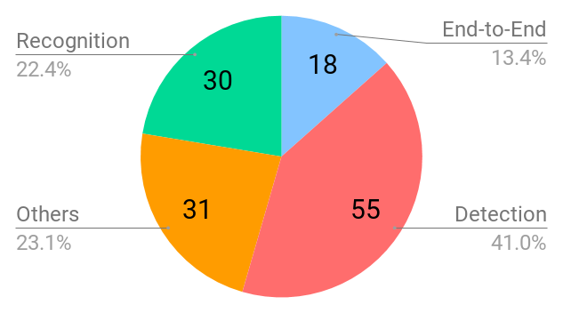

# STR
Scene Text Det and Rec Resource

[Strategy](strategy.md)

## Text Recognition
* Papers are sorted by published date.
* IC is shorts for ICDAR.
* Score is word-accuracy for recognition task.
  * For results on IC03, IC13, and IC15 dataset, papers used different numbers of samples per paper,  
  but we did not distinguish between them
* `*CODE` means official code and `CODE(M)` means that trained model is provided.  

*Conf.* | *Date* | *Title* | *SVT* | *IIIT5k* | *IC03* | *IC13* | *Resources* |
:---: | :---: |:--- | :---: | :---: | :---: | :---: | :---: |
'15-ICLR	| 14/12/18	| [Deep structured output learning for unconstrained text recognition](https://arxiv.org/pdf/1412.5903.pdf) |	0.717 | |0.896	| 0.818 | [`TF`](https://github.com/AlexandreSev/Structured_Data)   [`SLIDE`](https://www.robots.ox.ac.uk/~vgg/publications/2015/Jaderberg15a/presentation.pdf)   [`VIDEO`](https://www.youtube.com/watch?v=NYkG38RCoRg)
'16-IJCV	| 15/05/07	| [Reading text in the wild with convolutional neural networks](https://arxiv.org/pdf/1412.1842.pdf)	| 0.807	|	| 	0.933	| 0.908 | [`KERAS`](https://github.com/mathDR/reading-text-in-the-wild)
'16-AAAI	| 15/06/14	| [Reading Scene Text in Deep Convolutional Sequences](https://arxiv.org/pdf/1506.04395.pdf)
'17-TPAMI	| 15/07/21	| [An end-to-end trainable neural network for image-based sequence recognition and its application to scene text recognition](https://arxiv.org/pdf/1507.05717.pdf)	| 0.808	| 0.782 | 0.894	| 0.867 | [`TORCH(M)`](https://github.com/bgshih/crnn)    [`TF`](https://github.com/weinman/cnn_lstm_ctc_ocr)    [`TF`](https://github.com/watsonyanghx/CNN_LSTM_CTC_Tensorflow)   [`TF`](https://github.com/MaybeShewill-CV/CRNN_Tensorflow)   [`TF`](https://github.com/bai-shang/OCR_TF_CRNN_CTC)   [`PYTORCH`](https://github.com/meijieru/crnn.pytorch)    [`PYTORCH(M)`](https://github.com/BelBES/crnn-pytorch)   [`BLOG(KR)`](https://medium.com/@mldevhong/%EB%85%BC%EB%AC%B8-%EB%B2%88%EC%97%AD-rcnn-an-end-to-end-trainable-neural-network-for-image-based-sequence-recognition-and-its-f6456886d6f8)
'16-CVPR	| 16/03/09  | [Recursive Recurrent Nets with Attention Modeling for OCR in the Wild](https://arxiv.org/pdf/1603.03101.pdf) |	0.807 | 0.784	| 0.887	| 0.9 |
'16-CVPR	| 16/03/12	| [Robust scene text recognition with automatic rectification](https://arxiv.org/pdf/1603.03915.pdf) |	0.819	| 0.819 | 0.901	| 0.886 | [`PYTORCH`](https://github.com/marvis/ocr_attention)   [`PYTORCH`](https://github.com/WarBean/tps_stn_pytorch) 
'16-CVPR	| 16/06/27	| [CNN-N-Gram for Handwriting Word Recognition](https://www.cs.tau.ac.il/~wolf/papers/CNNNGram.pdf) |	0.8362 | | | | [`VIDEO`](https://www.youtube.com/watch?v=czc2Ipm3Bis)
'16-BMVC	| 16/09/19	| [STAR-Net: A SpaTial Attention Residue Network for Scene Text Recognition](http://www.visionlab.cs.hku.hk/publications/wliu_bmvc16.pdf) |	0.836	| 0.833	|	0.899	| 0.891 |
'17-arXiv	| 17/07/27	| [STN-OCR: A single Neural Network for Text Detection and Text Recognition](https://arxiv.org/pdf/1707.08831.pdf) | 0.798	| 0.86	| |	0.903 | [`*MXNET(M)`](https://github.com/Bartzi/stn-ocr)   [`PRJ`](https://bartzi.de/research/stn-ocr)   [`BLOG`](https://medium.com/@Synced/stn-ocr-a-single-neural-network-for-text-detection-and-text-recognition-220debe6ded4)
'17-IJCAI	| 17/08/19	| [Learning to Read Irregular Text with Attention Mechanisms](https://faculty.ist.psu.edu/zzhou/paper/IJCAI17-IrregularText.pdf) |
'17-arXiv	| 17/09/06	| [Scene Text Recognition with Sliding Convolutional Character Models](https://arxiv.org/pdf/1709.01727.pdf) |	0.765	| 0.816	| 0.845 |	0.852 |
'17-ICCV	| 17/09/07	| [Focusing Attention: Towards Accurate Text Recognition in Natural Images](https://arxiv.org/pdf/1709.02054.pdf) |	0.859 | 0.874 | 0.942 |	0.933 |
'18-CVPR	| 17/11/12	| [AON: Towards Arbitrarily-Oriented Text Recognition](https://arxiv.org/pdf/1711.04226.pdf) |	0.828	|0.87	| 0.915	||[`TF`](https://github.com/huizhang0110/AON)
'17-NIPS	| 17/12/04	| [Gated Recurrent Convolution Neural Network for OCR](https://papers.nips.cc/paper/6637-gated-recurrent-convolution-neural-network-for-ocr.pdf)	| 0.815	| 0.808 | 0.978 | | [`*TORCH(M)`](https://github.com/Jianfeng1991/GRCNN-for-OCR)
'18-AAAI	| 18/01/04	| [Char-Net: A Character-Aware Neural Network for Distorted Scene Text Recognition](http://www.visionlab.cs.hku.hk/publications/wliu_aaai18.pdf) |	0.844	| 0.836	| 0.915 |	0.908 |
'18-AAAI	| 18/01/04	| [SqueezedText: A Real-time Scene Text Recognition by Binary Convolutional Encoder-decoder Network](https://pdfs.semanticscholar.org/0e59/f7d7e9c9380b425a94038c7a2500b2f6063a.pdf) | |	0.87	| 0.931 |	0.929 |
'18-CVPR	| 18/05/09  | [Edit Probability for Scene Text Recognition](https://arxiv.org/pdf/1805.03384.pdf) | 0.875 | 0.883 | 0.946 | 0.944 |
'18-TPAMI	| 18/06/25	| [ASTER: An Attentional Scene Text Recognizer with Flexible Rectification](http://122.205.5.5:8071/UpLoadFiles/Papers/ASTER_PAMI18.pdf) |	0.936	| 0.934 |	0.945	| 0.918	| [`*TF(M)`](https://github.com/bgshih/aster)   [`PYTORCH`](https://github.com/ayumiymk/aster.pytorch)
'18-ECCV	| 18/09/08	| [Synthetically Supervised Feature Learning for Scene Text Recognition](http://openaccess.thecvf.com/content_ECCV_2018/papers/Yang_Liu_Synthetically_Supervised_Feature_ECCV_2018_paper.pdf) |	0.871	| 0.894	| 	0.947	| 0.94 |
'19-AAAI    | 18/09/18  | [Scene Text Recognition from Two-Dimensional Perspective](https://arxiv.org/pdf/1809.06508.pdf)   | 0.821 | 0.92 | | 0.914 |
'19-AAAI    | 18/11/02  | [Show, Attend and Read: A Simple and Strong Baseline for Irregular Text Recognition](https://arxiv.org/pdf/1811.00751.pdf)   | 0.845 | 0.915 | | 0.91 | [`*TORCH(M)`](https://github.com/wangpengnorman/SAR-Strong-Baseline-for-Text-Recognition)  
'19-CVPR    | 18/12/14  | [ESIR: End-to-end Scene Text Recognition via Iterative Image Rectification](https://arxiv.org/pdf/1812.05824.pdf)   | 0.902 | 0.933 |  | 0.913 | [PRJ](https://github.com/fnzhan/ESIR)  
'19-PR    | 19/01/10  | [MORAN: A Multi-Object Rectified Attention Network for Scene Text Recognition](https://arxiv.org/pdf/1901.03003.pdf)   | 0.883 | 0.912 | 0.950 | 0.924 | [`*PYTORCH(M)`](https://github.com/Canjie-Luo/MORAN_v2)  
'19-ICCV | 19/04/03 | [What is wrong with scene text recognition model comparisons? dataset and model analysis](https://arxiv.org/pdf/1904.01906.pdf) | 0.875 | | 0.949 | 0.936 | [`*PYTORCH(M)`](https://github.com/clovaai/deep-text-recognition-benchmark)   [`BLOG_KR`](https://data-newbie.tistory.com/156)
'19-CVPR | 19/04/18 | [Aggregation Cross-Entropy for Sequence Recognition](https://arxiv.org/pdf/1904.08364.pdf) | 0.826 | 0.823 | 0.921 | 0.897 | [`*PYTORCH`](https://github.com/summerlvsong/Aggregation-Cross-Entropy) | 
'19-CVPR | 19/06/16 | [Sequence-to-Sequence Domain Adaptation Network for Robust Text Image Recognition](http://openaccess.thecvf.com/content_CVPR_2019/papers/Zhang_Sequence-To-Sequence_Domain_Adaptation_Network_for_Robust_Text_Image_Recognition_CVPR_2019_paper.pdf) | 0.845 | 0.838 | 0.921 | 0.918 | |
'19-ICCV | 19/08/06 | [Symmetry-constrained Rectification Network for Scene Text Recognition](https://arxiv.org/abs/1908.01957) | 0.889 | 0.944 | 0.95  | 0.939 |  
'20-AAAI | 19/12/28 | [TextScanner: Reading Characters in Order for Robust Scene Text Recognition](https://arxiv.org/abs/1912.12422) | 0.895 | 0.926 |       | 0.925 |  
'20-AAAI | 19/12/21 | [Decoupled Attention Network for Text Recognition](https://arxiv.org/abs/1912.10205) | 0.892 | 0.943 | 0.95  | 0.939 | [`*PYTORCH(M)`](https://github.com/Wang-Tianwei/Decoupled-attention-network)  
'20-AAAI | 20/02/04 | [GTC: Guided Training of CTC](https://arxiv.org/abs/2002.01276) | 0.929 | 0.955 | 0.952 | 0.943 | [`Detail`](./paper/GTC.md)
'20-ECCV | 20/07/04 | [PlugNet: Degradation Aware Scene Text Recognition Supervised by a Pluggable Super-Resolution Unit](https://www.ecva.net/papers/eccv_2020/papers_ECCV/papers/123600154.pdf) | 0.923 | 0.944 | 0.957 | 0.950 | [`*PYTORCH`](https://hub.fastgit.org/huiyang865/plugnet)   [`Detail`](./paper/PlugNet.md)
'21-CVPR | 20/12/10 | [Sequence-to-Sequence Contrastive Learning for Text Recognition](https://arxiv.org/abs/2012.10873) | 0.913| 0.948 |    | 0.940 | [`*PYTORCH(M)`](https://github.com/ku21fan/STR-Fewer-Labels)
'21-CVPR | 21/03/04 | [Toward Scene Text Recognition With Fewer Labels](https://arxiv.org/abs/2103.04400) | 0.913| 0.948 |    | 0.940 | [`*PYTORCH(M)`](https://github.com/ku21fan/STR-Fewer-Labels)
'21-CVPR | 21/03/06 | [Read Like Humans: Autonomous, Bidirectional and Iterative Language Modeling for Scene Text Recognition](https://arxiv.org/abs/2103.06495) | 0.955| 0.972 |    | 0.977 | [`*PYTORCH(M)`](https://github.com/FangShancheng/ABINet)   [`Detail`](./paper/Read_Like_Humans.md)
'21-CVPR | 21/05/04 | [Primitive Representation Learning for Scene Text Recognition](https://arxiv.org/abs/2105.04286) | 0.940 | 0.956 | 0.958  | 0.964 | [`*PYTORCH(M)`](https://github.com/RuijieJ/pren)   [`BLOG`](https://blog.csdn.net/u011489887/article/details/120230030?spm=1001.2014.3001.5501)
'21-ICCV | 21/07/12 | [Joint Visual Semantic Reasoning: Multi-Stage Decoder for Text Recognition](https://arxiv.org/pdf/2107.12090.pdf) | 0.922 | 0.952 |   | 0.955 |
'21-ICCV | 21/08/09 | [From Two to One: A New Scene Text Recognizer with Visual Language Modeling Network](https://arxiv.org/pdf/2108.09661.pdf) | 0.917 | 0.958 |   | 0.957 | [`*PYTORCH(M)`](https://github.com/wangyuxin87/VisionLAN)   [`Detail`](https://zhuanlan.zhihu.com/p/402362039)

