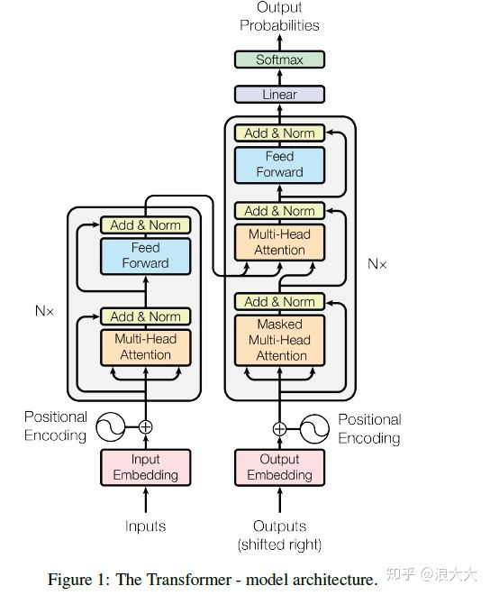

## RNN
1. 存在的问题： 对于较长的句子，RNN存在梯度消失的问题，为了解决长序列到定长向量的转化造成的信息损失问题引入Attention。
2. attention的改进: 计算encoder和decoder之间的关联性，使得输出会重点关注当前位置相关的隐藏层（权重比较大）。

## attention计算及其种类
### alignment-based attention 

输入 c（context，有的论文写s），y（input，有的地方也写作 h），输出 z。
1. score function:计算相似性.度量环境向量与输入向量的相似性，计算应该关注哪些重点。
   
2. alignment function:获得attention权重, 使用softmax进行归一化
   
3. generate context vector function: 根据attention权重，计算输出
   

### memory-based attention
该模式是QKV模型，Q是输入，KV是Key-Value形式存储的上下文，Q是新来的问题与已存的Key进行相似度对比。感觉在Q&A任务中，这种设置比较合理。Transform采用的这种方式。

1. address memory （score function）：
   
   
2. normalize（alignment function） ：
   
   
3. read content （gen context vector function） ：
   
   

### attention种类
attention 变化主要体现在score-funtion、generate context function。

1. attention的两大经典结构

2. Self Attention & Multi-head Attention
   + Self Attention
      为什么引入Self-Attention： 1.RNN 能够解决长距离依赖的问题，但由于递归的本质导致不能并行；2.CNN可以并行，但是局部信息依赖。3.self-attention 借鉴 CNN中 multi-kernel 的思想，进一步进化成为 Multi-Head attention。每一个不同的 head 使用不同的线性变换，学习不同的 relationship。
     
     
### [Transform详解(超详细) Attention is all you need](https://zhuanlan.zhihu.com/p/63191028)
文章的创新点：抛弃了原有encoder-decoder模型必须结合cnn或者rnn的固有模式，只用Attention，文章的主要目的在于减少计算量和提高并行效率的同时不损害最终的实验结果。

1. 其本质是Seq2Seq模型，左边输入，右边输出。
2. 在self-Attention的基础上组成Multi-head Attention，还有positional encoding，residuals 这些小而美的东西。
   

