## RNN
1. 存在的问题： 对于较长的句子，RNN存在梯度消失的问题，为了解决长序列到定长向量的转化造成的信息损失问题引入Attention。
2. attention的改进: 计算encoder和decoder之间的关联性，使得输出会重点关注当前位置相关的隐藏层（权重比较大）。

## attention计算及其种类
### alignment-based attention 
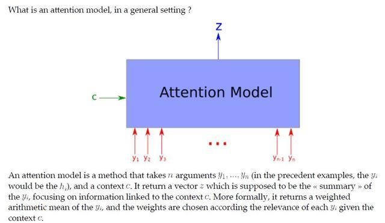
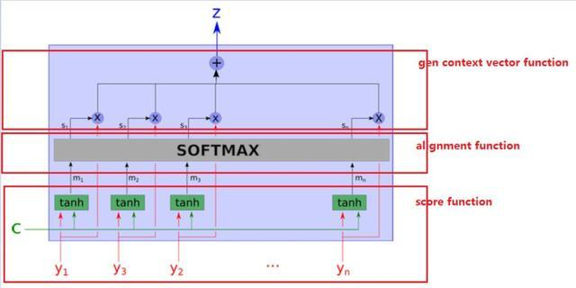
输入 c（context，有的论文写s），y（input，有的地方也写作 h），输出 z。
1. score function:计算相似性.度量环境向量与输入向量的相似性，计算应该关注哪些重点。
   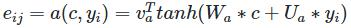
2. alignment function:获得attention权重, 使用softmax进行归一化
   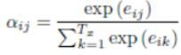
3. generate context vector function: 根据attention权重，计算输出
   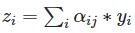

### memory-based attention
该模式是QKV模型，Q是输入，KV是Key-Value形式存储的上下文，Q是新来的问题与已存的Key进行相似度对比。感觉在Q&A任务中，这种设置比较合理。Transform采用的这种方式。
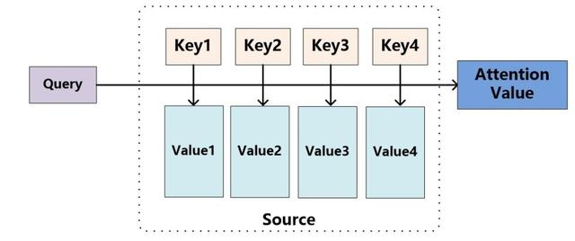
1. address memory （score function）：
   
   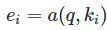
2. normalize（alignment function） ：
   
   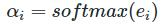
3. read content （gen context vector function） ：
   
   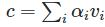

### attention种类
attention 变化主要体现在score-funtion、generate context function。
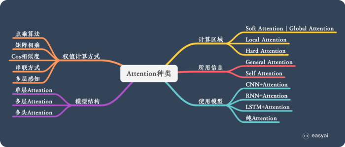
1. attention的两大经典结构
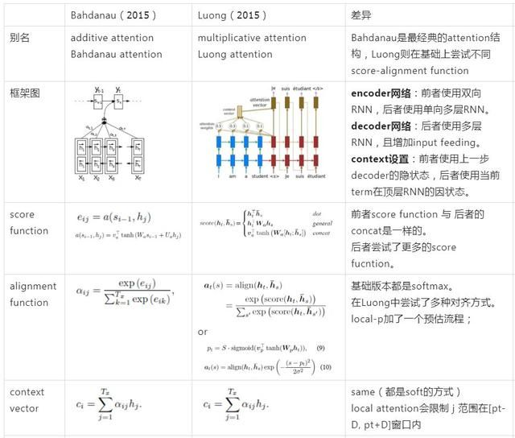
2. Self Attention & Multi-head Attention
   + Self Attention
      为什么引入Self-Attention： 1.RNN 能够解决长距离依赖的问题，但由于递归的本质导致不能并行；2.CNN可以并行，但是局部信息依赖。3.self-attention 借鉴 CNN中 multi-kernel 的思想，进一步进化成为 Multi-Head attention。每一个不同的 head 使用不同的线性变换，学习不同的 relationship。
     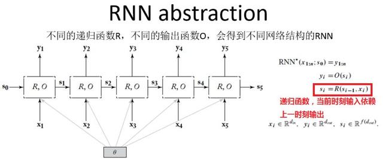
     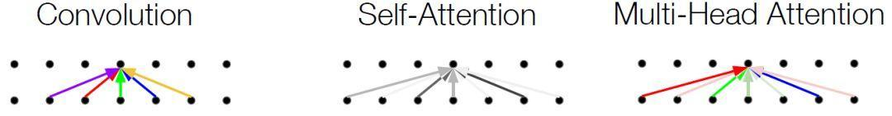
### [Transform详解(超详细) Attention is all you need](https://zhuanlan.zhihu.com/p/63191028)
文章的创新点：抛弃了原有encoder-decoder模型必须结合cnn或者rnn的固有模式，只用Attention，文章的主要目的在于减少计算量和提高并行效率的同时不损害最终的实验结果。
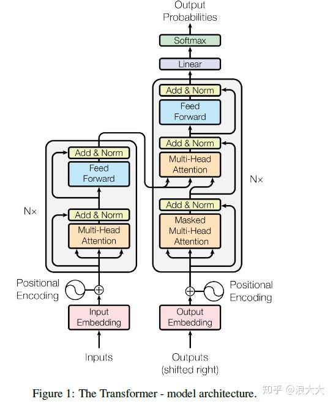
1. 其本质是Seq2Seq模型，左边输入，右边输出。
2. 在self-Attention的基础上组成Multi-head Attention，还有positional encoding，residuals 这些小而美的东西。
3. QKV模式的来源：
   为什么要有QKV向量，因为这个思路来自于比较早的信息检索领域，就是query，就是key，就是值，(k,v)就是键值对、也就是用query关键词去找到最相似的K，根据K得到V。
4. QKV的计算: 
    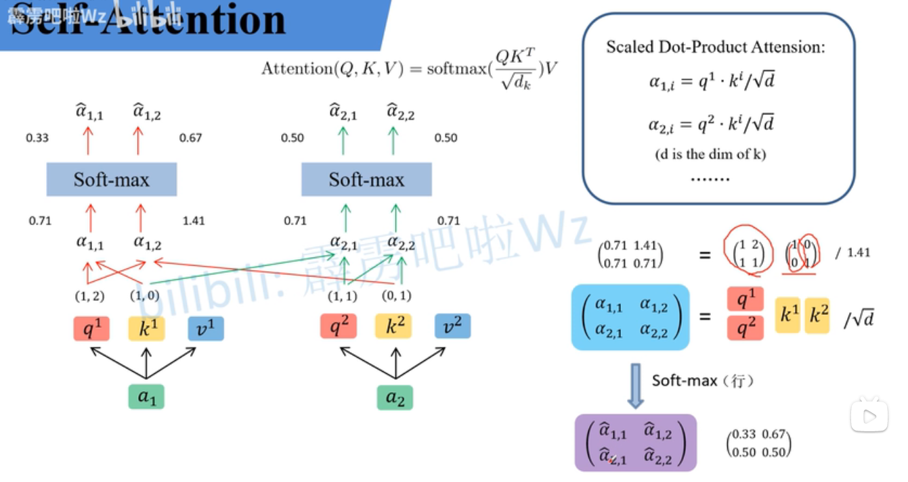
   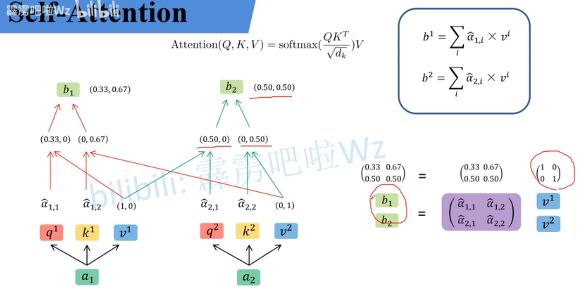
   为了得到query，key，value，一个x就得做3次矩阵乘法，之所以用矩阵乘法而不是神经网络，是因为
   GPU能对矩阵运算加速，GPU中矩阵运算的复杂度是O(1)不是O(N*N)。其中d代表向量K的长度，除以根号d的原因原论文说，
   点乘后数值很大，导致softmax后导数很小。因此通过根号d进行缩放。

细节拆分：
1. 输入Embedding
2. Positional Encoding
   
   进行位置编码是因为若输入的顺序变化（[q1,q2,q3] 和 [q1,q3,q2]）,其得到的b1不受影响。
   ```python
      import torch
      import torch.nn as nn
      
      m = nn.MultiheadAttention(embed_dim=2, num_heads=1)
      
      t1 = [[[1., 2.],   # q1, k1, v1
             [2., 3.],   # q2, k2, v2
             [3., 4.]]]  # q3, k3, v3
      
      t2 = [[[1., 2.],   # q1, k1, v1
             [3., 4.],   # q3, k3, v3
             [2., 3.]]]  # q2, k2, v2
      
      q, k, v = torch.as_tensor(t1), torch.as_tensor(t1), torch.as_tensor(t1)
      print("result1: \n", m(q, k, v))
      
      q, k, v = torch.as_tensor(t2), torch.as_tensor(t2), torch.as_tensor(t2)
      print("result2: \n", m(q, k, v))

   ```
   位置编码的两种方式：
   1. 直接加在输入a中
   2. 可训练的位置编码
3. Multi-head Attention
   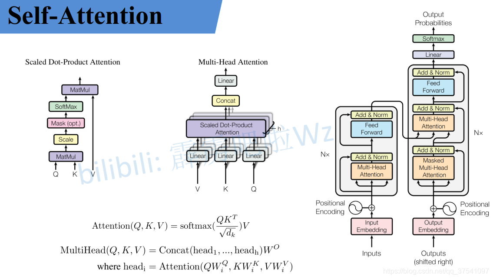
4. Add & norm
5. Feed Forward
6. Masked Multi-head Attention  
   Masked Multi-Head Attention 是在Scaled Dot-Product Attention的结构中加入了mask单元，以防止在解码时访问到当前位置之后的信息，本质上是加了mask的Multi-Head Attention。

   
## 基于attention的文字识别方法
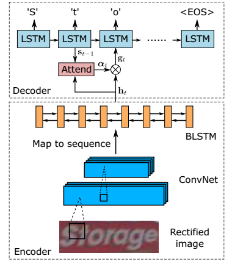
基于attention的文字识别基本原理：举个例子，假设输入灰度图像resize之后大小为(32, 100)，经过特征提取网络进行编码之后变为（26, 96），这里忽略掉了batch size，其中26是序列长度，也就是时间步；
96是字符类别，包括数字、大小写英文字母以及常用标点符号，再加上两个特殊字符，“[GO]”表示开始, “[s]”表示文本结束。推理阶段采用beam search 进行输出。

ICDAR 2019冠军github地址：https://github.com/zhang0jhon/AttentionOCR


