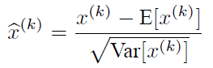
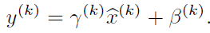
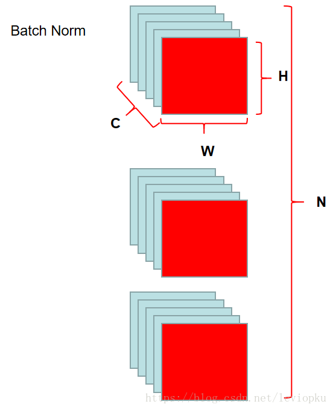
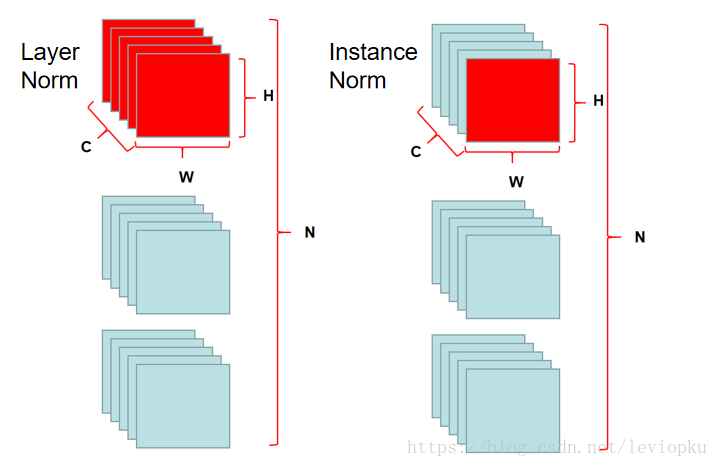
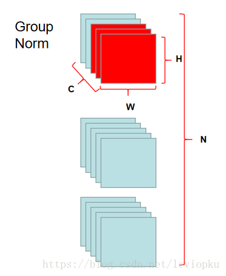
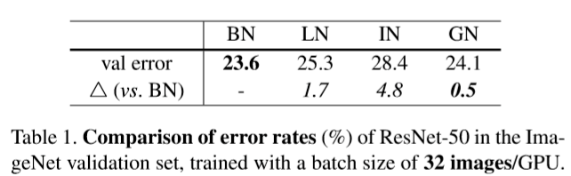
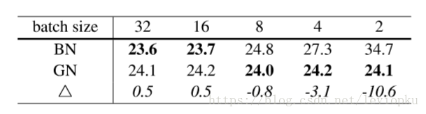
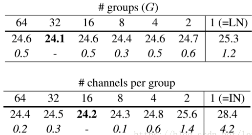

## BN回顾
BN全称Batch Normalization。是为了对网络每层的数据进行归一化。
## 网络的层数据的归一化
机器学习里有个很重要的假设，训练数据和测试数据是同分布的。batchsize越大越能反应整体分布，训练效果越好。
但是网络内部，每次参数更新，都会导致每一层的参数分布发生变化，就会导致模拟效果差，收敛速度慢。
而BatchNorm就是在深度神经网络训练过程中使得每一层神经网络的输入保持相同分布的。
近似白化预处理：

上面是各神经元的平均值，下面是各神经元输入值的标准差。
## 直接归一化的问题
直接归一化强制的转换会导致数据的分布特征发生破坏，比如本来数据大部分都在0的右边，经过RELU激活函数以后大部分会被激活，如果直接强制归一化，那么就会有大多数的数据无法激活了，这样学习到的特征就被破坏掉了。
引出变换重构：

当gama等于训练数据方差，beta等于训练数据期望时，可以恢复原始数据的特征分布。

BN的好处：
1. 防止网络梯度消失：这个要结合sigmoid函数进行理解
2. 加速训练，也允许更大的学习率：输出分布向着激活函数的上下限偏移，带来的问题就是梯度的降低，（比如说激活函数是sigmoid），通过normalization，数据在一个合适的分布空间，经过激活函数，仍然得到不错的梯度。梯度好了自然加速训练。
3. 降低参数初始化敏感：以往模型需要设置一个不错的初始化才适合训练，加了BN就不用管这些了，现在初始化方法中随便选择一个用，训练得到的模型就能收敛。
4. 提高网络泛化能力防止过拟合：所以有了BN层，可以不再使用L2正则化和dropout。可以理解为在训练中，BN的使用使得一个mini-batch中的所有样本都被关联在了一起，因此网络不会从某一个训练样本中生成确定的结果。
5. 可以把训练数据彻底打乱（防止每批训练的时候，某一个样本都经常被挑选到，文献说这个可以提高1%的精度）。

原论文这样说：简单地在网络中添加批处理规范化并不能充分利用我们的方法。为此，我们进一步改变了网络及其训练参数，如下：
1. 增大学习率，加速收敛。如果每层的scale不一致，实际上每层需要的学习率是不一样的，同一层不同维度的scale往往也需要不同大小的学习率，通常需要使用最小的那个学习率才能保证损失函数有效下降，Batch Normalization将每层、每维的scale保持一致，那么我们就可以直接使用较高的学习率进行优化。
2. 移除dropout，减少训练时间。dropout是常用的防止overfitting的方法，而导致overfit的位置往往在数据边界处，如果初始化权重就已经落在数据内部，overfit现象就可以得到一定的缓解。论文中最后的模型分别使用10%、5%和0%的dropout训练模型，与之前的40%-50%相比，可以大大提高训练速度。
3. 减小L2正则。还是一样的问题，边界处的局部最优往往有几维的权重（斜率）较大，使用L2衰减可以缓解这一问题，现在用了Batch Normalization，就可以把这个值降低了，论文中降低为原来的5倍。
4. 取消Local Response Normalization层。由于使用了一种Normalization，再使用LRN就显得没那么必要了。而且LRN实际上也没那么work。
5. 由于现在训练epoch数降低，所以要对输入数据少做一些扭曲，让神经网络多看看真实的数据。

## BN 与 GN
1. 对于BN来讲，norm的操作范围是下图：
   
    
2. LN 和 IN 如下：
   
    
3. GN
   
    
   
4. BN 与 GN 效果对比
   
    
    
5. GN参数对比
   
    

总结：GN相对于BN的优势在于受batchsize大小的影响较小。

### BN与LN
1. LN是针对一个样本内的归一化处理，不受batchsize的影响，适用于LSTM的加速，但CNN加速时并没有取得比BN更好的效果。
2. BN不适用与RNN的normalize操作，BN实际需要计算并保存某一层的均值方差，对一个
固定的CNN使用BN很方便，但对于RNN来说，RNN的深度不固定，不同的time-step需要保存
不同的statics特征，这样计算很麻烦，LN可以有效的解决上述问题
   
   
### transformer 用什么归一化
transformer用LN进行归一化操作效果更好。
1. BN是针对图像数据从0，1分布恢复到原始分布的方法。
2. LN有助于在球体空间中得到0，1分布的emdedding。
3. LN对一词多义的空间表达施加了约束，有效降低模型方差。