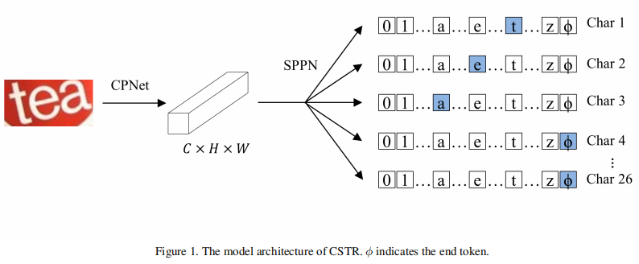
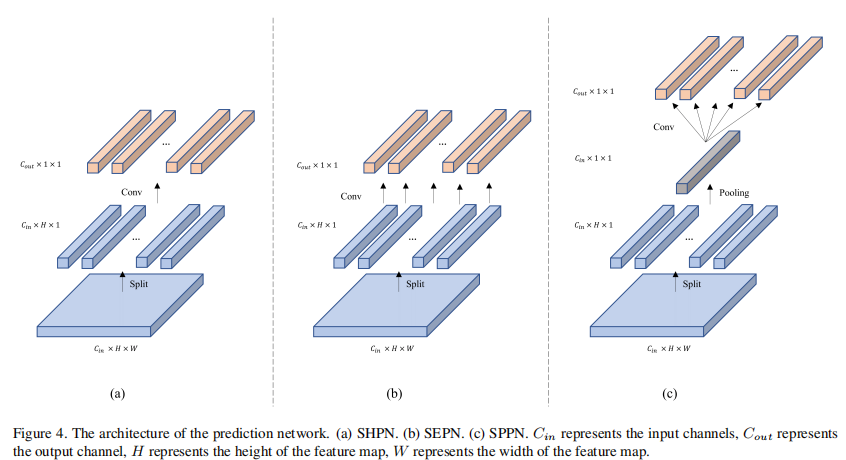
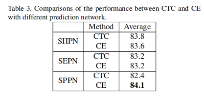

## CSTR: Revisiting Classification Perspective on Scene Text Recognition
文字识别方法一般有两个方向：基于字符级别的语义分割方法（segmentation-based），基于文本行的序列到序列方法（seq2seq-based）。本文别树一帜，将文字识别建模为图像分类（classification-based）。

### CTC 与 CE 预测方法
1. CTC：解决输入和输出的对齐问题,如label的长度小于输出的长度。
2. CE（Cross Entropy Loss）：解决对齐的另一种办法时seq2seq+attention机制，输出时加上结束符，让模型和label自动对齐。
    1. 本文是基于图像分类的方法做识别，用的也是CE损失函数，并认为CTC的对齐方式不是必须的。

### CTC 与 CE实验对比

1. Shared conv prediction network (SHPN)：传统的卷积方式，一般接CTC解码
2. Separated conv prediction network (SEPN)：用可分离卷积，每个特征图对应输出一个字符。
3. Separated conv with global average pooling prediction network (SPPN)：全局池化后再卷积。

   
实验结果分析：
1. 前两种网络架构在CTC和CE上实验结果接近，说明CTC的对齐过程不是必要的。
2. SHPN的结果比SEPN好，说明全局信息的重要性
3. SPPN说明了全局感受野对基于CELoss的方法是必要的。

