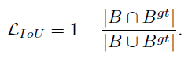
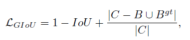
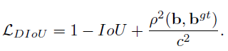
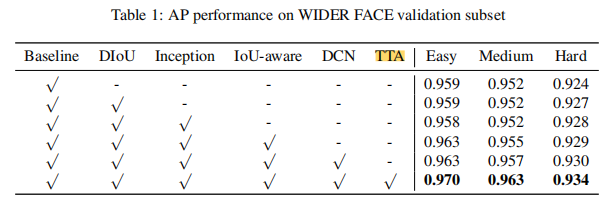

## [MogFace](https://arxiv.org/pdf/2103.11139.pdf)
1. 全局语义有助于较少误报
2. 选择性尺度增强策略  并不是金字塔层匹配的anchor越多效果越好

## [TinaFace](https://arxiv.org/pdf/2011.13183.pdf)
1. 可变形卷积增强检测形变能力：提高对几何形变的检测能力
2. inception模块增强多尺度检测（除此之前外，多尺度训练，FPN等方法）
3. IOU-aware 帮助一阶段算法提高分类分数，抑制假阳。
4. Distance-Iou Loss 增加小目标的损失，提高小目标检测性能
    + 普通IOU 在候选框和真实框无重叠时没有loss，损失始终为1 
      
    + GIOU 增加无重叠时的损失，除以最小box面积 
      
    + DIOU 弥补了GIOU在两者重叠时，损失不变的缺点，除以最小box对角线长度 
      
    + CIOU 解決中心点重合，但宽高比不同时，loss不变的情况。 在Diou的基础上增加影响因子a,v把长宽比的一致性考虑进去。

      
## [PyramidBox](https://arxiv.org/pdf/1803.07737.pdf)
PyramidBox是2018年的人脸检测冠军方案,主要贡献点如下：
1. 提出了一种基于anchor的上下文辅助方法——pyramidAnchor，在为小，模糊和部分遮挡的人脸的上下文特征学习引入监督信息。
2. 设计了一种低层特征金字塔网络LFPN来更好的整合上下文和人脸特征，该方法用single-shot的方式来处理不同尺度的人脸。

3. 引入一个上下文敏感预测模块，该模块由一个混合网络结构和max-in-out层组成并重合并的特征中学习准去的位置和分类。
4. 提出尺度感知的Data-anchor-sampling策略来改变训练样本的分布，从而更加关注较小的人脸。
5. 在FDDB和WIDER FACER两个通用人脸检测基本数据集上取得了最好的性能。
