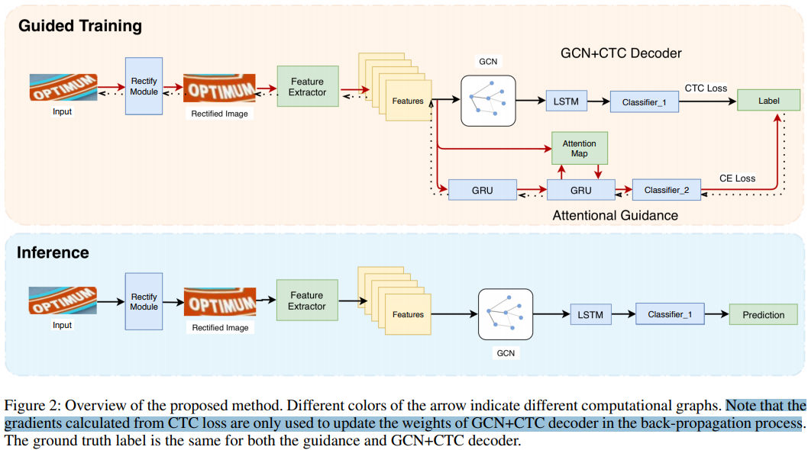
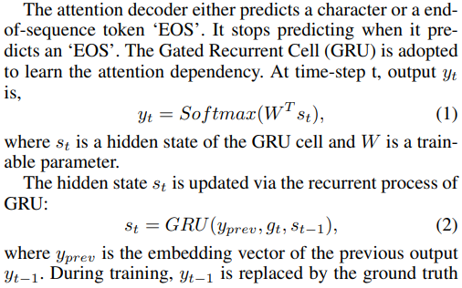
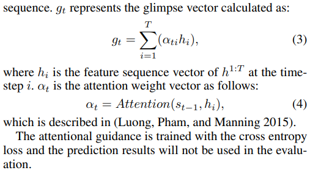
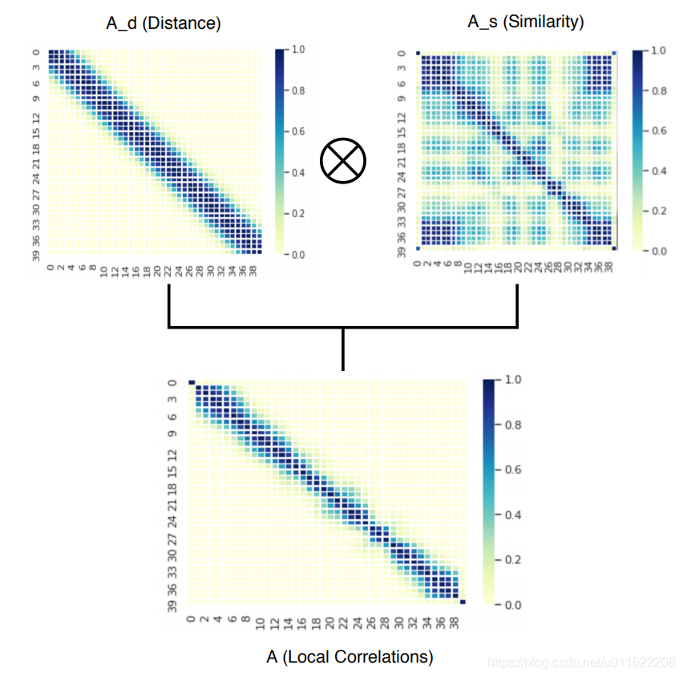

## CTC的问题
1. **字符位置的不确定导致CNN学习的特征差强人意**
   
    举个例子来说，在训练过程中，由3个timestep解码成“加油”的路径可以有5条，分别是“-加油”， “加-油”，“加油-”，“加加油”，“加油油”，CTC在计算损失的过程中，这5条路径都会对CNN的特征提取产生影响，但是这种影响是模糊的，因为“加”字不仅可能会出现在第1个time step，还可能会出现在第2个time step， 同样的对于”油“字，可能出现在第2个time step， 也可能出现在第3个time step，CNN的在提取特征的时候由于不知道每个字特定的位置，很难提取到有效的特征，这就是CTC loss的灵活性所带来的一个缺陷。

2. **未考虑特征的局部关联导致解码错误**
   
    在很多情况下，一个字不止会占据1个time step，而是连续的几个time step， 这几个连续的time step都包含有这个字的特征。拿“静”这个字来说，它的连续特征中最前面的那个time step很可能只是学习了“青”这部分的特征，而到连续特征的结尾才学到”静“字的特征，解码会解成”青静“，让人蛮苦恼，大部分左右结构的字都很可能出现这样的问题。
   
## GTC
### CNN特征学习加强

对于第一个问题来说，作者考虑的是使用attention来引导CNN特征的学习。论文中有谈到attention机制能够学习字符之间的关联性，从而能够对字符有较好的定位，并且学习到更加有效的特征，但是使用attention机制来引导特征学习，由于它用到之前time step的一些信息，不可以并行计算，所以在inference时会非常耗时。而对于CTC方法来说，虽然CNN学习到的字符特征并不准确，但是它的inference time真的非常短。

作者在训练阶段添加了额外的GRU+attention模块，并将计算图分割，用于引导CNN的学习：

### 同字符特征集中化
为了将同一个label的序列特征更加集中化，作者使用了GCN（图卷积网络）来捕捉特征之间的依赖关系，并基于所得到的依赖关系将相同label的特征合并。

在CRNN中，CNN的作用是用来提取特征，BiLSTM的作用是学习特征上下文之间的关系，这两者都不能将同一个label的特征集中化。所以作者提出了使用GCN网络，通过引入相似性邻接矩阵和距离矩阵来共同描述上下文的关系，使得label的特征能够更加强化。GCN网络被用在CNN网络之后，BiLSTM网络之前。
通过引入相似矩阵和距离矩阵来考虑特征之间的关系，能够将label的特征更加强化，可以解决前面所说的第二个问题.

## 总结
- 利用attention分支对矫正网络和特征提取网络进行一定的监督作用
- 在crrn分支中加入GCN，加强序列特征局部的学习。
