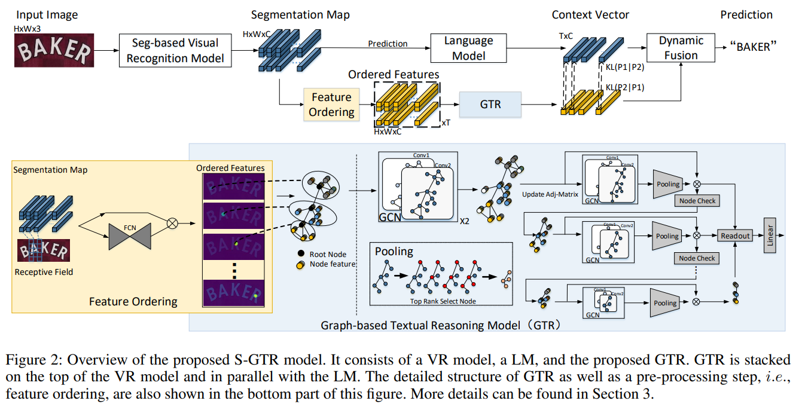

## 摘要
现有的场景文本识别（STR）方法通常使用语言模型来优化视觉识别（VR）模型预测的一维字符序列的联合概率, 然而忽略了字符实例内部和字符实例之间的二维空间视觉语义，使得这些方法不能很好地应用泛化到任意形状的场景文本。为了解决这个问题，本文中首次尝试利用视觉语义进行文本推理。具体而言，在给定 VR 模型预测的字符分割图，首先为每个字符实例构建一个子图，并通过根节点顺序连接合并成一个完整的图。其次基于该图，我们设计了一个图卷积网络(GTR)进行视觉文本推理。同时我们将GTR 和语言模型结构并行构建S-GTR，通过相互学习有效地利用视觉语言互补性。另外GTR 可以插入不同的STR 模型以提高其识别性能。实验证明了所提方法的有效性，S-GTR 在六个通用场景文字识别数据集上获得较好表现，并可以推广到多语言数据集。

## 相关工作
### Semantic Context Reasoning
为了进一步增强文本识别的性能。一些方法开始结合语言语义信息改善纯视觉方法。
1. SEED提出使用来自FastText的词嵌入，其依赖单词的语义而不是视觉信息
2. SRN使用基于transformer的方法，其语义信息通过注意力机制获得。并且使用并行的transform结构。
3. ABInet基于SRN，迭代修正来增强语义推理。

基于语义推理，我们提出了基于图网络语义推理来补充语言建模，进而充分利用视觉信息和语言语义信息来改善识别结果。
### Graph-structure Data Reasoning
1. 在Deep relational reasoning graph network for arbitrary shape text detection 论文中采用图卷积神经网络（GCN）来连接属于同一个
单词的字符。
2. 论文GTC利用GCN来指导CTC做文字识别。尤其是使用视觉的切片特征作为图节点，不捕获了同一个实例的依赖以及特征融合。
3. PREN2D通过GCN采用元学习框架来提取视觉表示。

本论文我们采用基于GCN的两层图网络来进行字符实例的空间语义推理来改善视觉识别结果。

