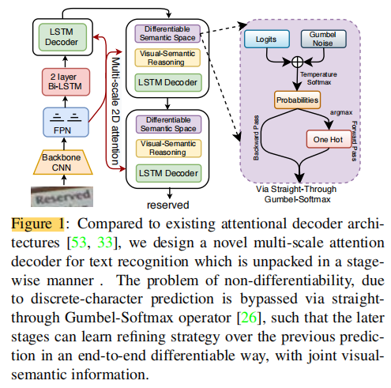
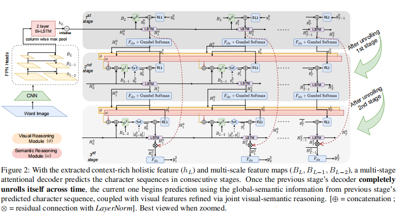
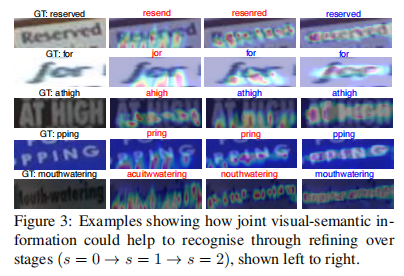

## 摘要
当前的主流识别模型主要基于视觉模型而缺乏语义推理能力。我们认为语义信息还起着补充作用。
我们通过多个阶段的注意力解码来获取语义信息。我们的创新之处在于阶段性预测，因此设计了
阶段注意理解码器。由于预测的字符标签的不可微性，端到端的训练需要绕过。
第一阶段预测使用视觉特征，后续阶段使用联合视觉语义信息。此外，我们还引入了多尺度2D注意，
以及不同阶段之间的密集和残差连接，以处理不同尺度的字符，从而获得更好的性能和效果，以及更快地收敛。

## 介绍
在自然场景下，图片中文字可能模糊，扭曲，部分遮挡等情况，单独利用视觉特征使得识别极度困难。而人却可以利用
已识别出的文字进行推理。受此启发，我们提出了多阶段的识别预测模型。

