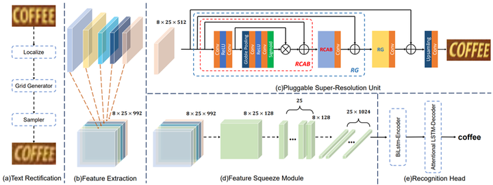
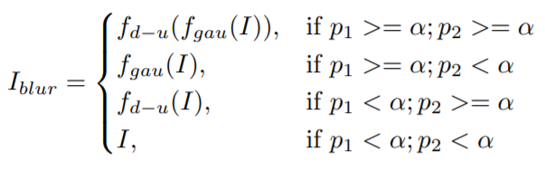
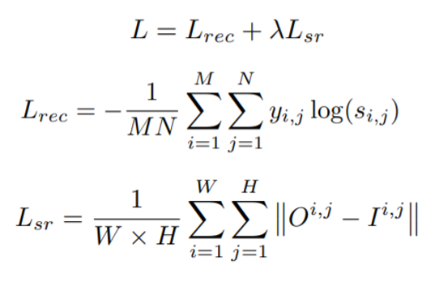
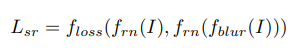
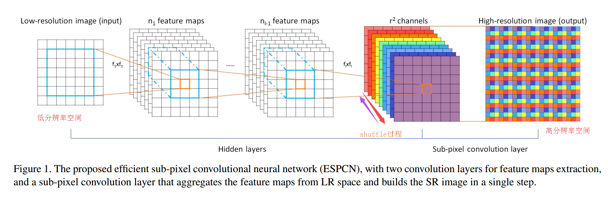

## 动机
解决模糊问题往往需要依赖于串联一个大型的超分辨网络来进行图像级的超分辨学习，以此改善输入图像的质量。这种方案往往需要依赖有力的数据集划分以及大量的计算资源，在实际应用中显得并不具有性价比。
因此，作者提出了一个含有可插拔超分辨单元的端到端学习的文本识别方法（PlugNet）。通过在训练时增加超分辨支路来改善特征表达的方式提升低质量文本的识别结果，这也就意味着相对于原始的文本识别方案，PlugNet在应用时（前向计算）没有增加任何额外的计算量。

PlugNet的主要贡献在于:

+ 利用特征级超分辨学习来增加用于识别特征的鉴别能力，进而提升文本识别结果的精度。
+ 针对原始文本识别方法使用CNN压缩图像分辨率的问题，提出了使用特征压缩模块进行替代，尽可能的更好的保留特征原始的空间特性。
+ 算法训练时间无显著增加，推理时间不变的情况下，低质量图像精度显著提升，非常有利于对实时和精度要求较高的应用场景。



PlugNet的构建基于自顶而下的文本识别方案，共包含五个模块，分别是校正模块、特征提取模块、特征压缩模块、识别模块和可插拔的超分辨单元。

1. 校正模块：使用一个简单的浅层卷积神经网络预测了20个关键点位置来约束文字的上下边缘，并通过TPS方法从原始的图像中采样得到校正图像。
2. 特征提取模块：沿袭了ResNet的结构作为主干网络，选取了四倍下采样的特征图来作为最终的特征尺度。为了更好的将底层特征引入到识别的部分中，作者使用了一个特征增强块，通过将不同层的特征下采样并进行通道融合，让最终的特征能够获取多元化的语义信息。
3. 特征压缩模块：通过1*1降维和Reshape的方式，从特征提取模块输出的特征中，获取到输入到识别模块的1维向量。
在传统的文本识别方案中，常使用CNN来进行特征的压缩，但是在过去两年的研究中发现，CNN对于空间特征显得并不敏感，这在一定程度上使得过去的文本识别方法的校正部分，不能够很好的对文本的上下边缘进行预测。
因此，PlugNet采用了更为直接的手段，采用特征压缩模块取代了传统的CNN压缩，更多的保留了原始的空间位置信息。
4. 识别模块：使用基于LSTM的Encoder-Decoder架构，这种方案在过去的数年中，在文本识别领域取得了极佳的效果。因此，PlugNet在识别部分仍然沿用了这一方案，通过将特征压缩模块得到的一维向量输入到双向LSTM的Encoder和基于注意力机制的Decoder结构,最终输入文本识别的结果。
5. 可插拔超分辨单元：使用了2个基于Resnet结构的超分辨基础单元和一个上采样部分，将共享的特征恢复成原始图像对应的超分辨图像。为了更好的训练超分辨单元、改善特征的表达，使用了如下两种特征增强的方式：高斯模糊和4倍上下采样。其生成方式可以表示为：



其中，fd-u和fgau分别代表4倍上下采样和高斯模糊处理，p1和p2是两个随机参数，α 是文章中所使用的阈值。

在损失函数部分，作者使用了一个比较通用的多任务形式，总的损失由文本识别部分的交叉熵损失和超分辨部分的L1损失构成，并使用了一个超参数对两个部分的权重进行调节，这部分可以描述为：





frn 是修正网络，fblur是上述图像模糊函数。原图像先经过修正网络，得到原始图像I；模糊处理图像经过修正网络再经过PSU得到O。
最终使用L1 loss来计算损失。 如果没有修正网络，那么原始图像I是输入图像，out图像是模糊处理后并经过PSU模块得到的。

## 源码解析

```python
class MeanShift(nn.Conv2d):
    def __init__(self, rgb_range, rgb_mean, rgb_std, sign=-1):
        super(MeanShift, self).__init__(3, 3, kernel_size=1)
        std = torch.Tensor(rgb_std)
        # 采用1×1卷积的形式进行标准化操作，首先建立一个三通道到三通道的恒等映射
        self.weight.data = torch.eye(3).view(3, 3, 1, 1)
        self.weight.data.div_(std.view(3, 1, 1, 1))
        # 减去均值
        self.bias.data = sign * rgb_range * torch.Tensor(rgb_mean)
         # 与上边的除操作一起，相当于将整体除以标准差(output=(w*x+b)/std)
        self.bias.data.div_(std)
        self.requires_grad = False
```
1. torch.eye(3) 返回对角线为1其他为0的3*3张量, view 相当于resize
2. div_() 是除法操作
3. self.requires_grad = False 固定参数

这段代码完成了特征的标准化工作。我们自定义固定的1*1卷积核与偏置进行操作，
这里标准差与均值通常来源于预训练的VGG网络。另外，注意这个模块继承2d卷积层，并未定义forward操作，
而是直接继承原始卷积层的forward操作。

在RCAN中使用Pixelshuffle来进行上采样：
PixelShuffle是一种上采样方法，可以对缩小后的特征图进行有效的放大。可以替代插值或解卷积的方法实现upscale。
PixelShuffle(像素重组)的主要功能是将低分辨的特征图，通过卷积和多通道间的重组得到高分辨率的特征图。这一方法最初是为了解决图像超分辨率问题而提出的，这种称为Sub-Pixel Convolutional Neural Network的方法成为了上采样的有效手段。
要把一张低分辨输入转变为高分辨输出，论文ESPCN中提出用基于特征抽取和亚像素卷积的方法来扩大特征图，具体来说，就是将原来一个低分辨的像素划分为rr各更小的格子，利用rr个特征图对应位置的值按照一定的规则来填充这些小格子。
按照同样的规则将每个低分辨像素划分出的小格子填满就完成了重组过程。在这一过程中模型可以调整r*r个shuffle通道权重不断优化生成的结果。
主要实现了这样的功能：N\*(C\*r\*r)\*W\*H---->>N\*C\*(H\*r)*(W*r)



## 思路总结：
1. 提升模糊识别，两种思路
    + 一种是图片层面，先把图片变清晰，再送入网络。相当于预处理接入一个网络，这样会增加额外的推理时间。
    + 从特征图层面出发，尝试从特征学到清晰图片的特征。 基于共享主干网络，不增加额外的时间。
2. 构建PSU模块
    + 从共享模块网络拉出1/4尺寸的特征图，8 * 80 * 512 的特征图，接入4层的浅层卷积，并上采样恢复原始尺寸，与高清图像做差取损失。
    