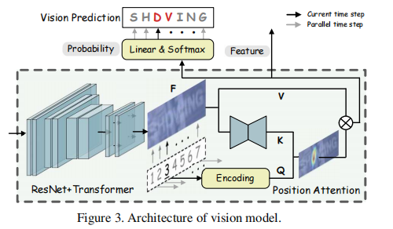
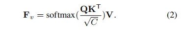
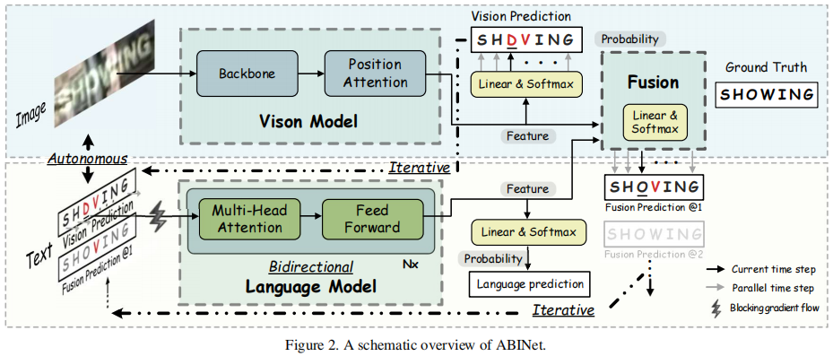

## 摘要
语言知识对场景文本识别有很大的益处。然而，如何有效地在端对端深度网络上建模语言规则仍然是一个研究挑战。
在论文中，我们认为语言模型的有限来源于：1）隐性地语言建模；2）双向的特征表示；3）带噪声输入的语言模型。
相应地，我们为场景文本识别提出了一个独立、双向、迭代的 ABINet 。第一，独立意味着阻止视觉模型和语言模型
之间梯度流（gradient flow）来强制执行显性的语言建模。第二，提出基于双向特征表示的语言模型 --- 一个新颖
的、双向完形填空网络（bidirectional cloze network，BCN）。第三，我们为语言模型提出了一个可迭代纠正的
执行方式，它能够有效地减轻噪声输入带来的影响。另外，基于迭代预测的集合，我们提出了一个自训练方法，它能够
有效地从无标签数据中学习。大量的实验证明ABINet在低质量图像中有优越性并在一些主流基准里实现了最优的结果。
经过集成自训练的 ABINet 在人类级别的识别上展示了极大的提升。代码可在 https://github.com/FangShancheng/ABINet 上获得。

## 引言
考虑到当前方法在内部交互、特征表示和执行方式的不足，受独立、双向、迭代原则的引导，我们提出了 ABINet 。首先，我们提出了一个通过阻断视觉模型和语言模型之间梯度流的解耦方法，强制语言模型更详细的学习语言规则。另外，语言模型和视觉模型都是独立的单元，能够分别通过文本和图片进行预训练。第二，我们设计一个新颖的双向完形填空网络（BCN）作为语言模型，它消除了结合两个单向模型的困境。BCN 通过指定注意力掩码来控制两边字符的访问，受左右两边上下文的共同条件约束。同时，跨步骤访问不被允许，以防止信息泄露。第三，我们提出了一个迭代纠正的执行方式作为语言模型。通过重复将 ABINet 的输出喂入语言模型，预测结果逐步的纠正，未对齐的长度问题在一定程度上被减轻。另外，将迭代预测作为一个集合，基于自训练的半监督方法被探索，它在人类层面的识别上得出一个新的解决方案。

文章的贡献主要包括：1）我们提出了一个独立、双向、迭代的原则去引导场景文本识别领域语言模型的设计。在这种原则下，语言模型是一种功能性单元，它需要提取双向表示和迭代纠正预测结果。2）提出新颖的BCN（双向完形填空网络），它像完形填空任务一样利用双向语言消除了字符的概率分布。3）提出的 ABINet 在主流基准上实现了最好的表现，经过集成自训练的 ABINet 在实现人级识别方面有了良好的改进。

## 相关工作
### Language-free Methods（无语言方法）
无语言方法通常利用视觉特征而不考虑字符间的关系，如基于 CTC 的方法和基于分割的方法。由于缺乏语言的信息，无语言的方法不能解决低质量图像的识别。

### Language-based Methods（基于语言的方法）
####  视觉和语言间的内部互动
基于attention 的方法采用encoder-decoder的结构，encoder处理图像，decoder通过从一维图像特征或者二维图像特征中集中相关信息生成字符。不同于以上方法，我们的方法通过显式语言建模致力于建立一个更强大的语言模型。为了提升语言表示，很多工作引入多损失，其中额外的损失来自于分割。SEED提出使用预训练的 FastText 模型来引导RNN的训练，它带来了额外的语义信息。
#### 语言模型的执行方式
目前，语言模型的网络结构主要基于 RNN 和 Transformer。基于 RNN 的语言模型通常用自回归的方式执行，将上一个字符的预测作为输入。GRU通过将上个时间步的预测向量和当前时间步的字符 特征作为输入来预测每个字符。基于Transformer的方 法并行执行，每个时间步的输入是视觉特征或来自视觉特征预测的字符嵌入。我们的方法采用并行执行，但我们尽量在并行的语言模型上减轻噪声输入的问题。

## 提出的方法
### 视觉模型

如图三，视觉模型由一个主干网络和一个位置注意力模块组成。在先前的方法中，ResNet 和 Transformer 单元作为特征提取网络和序列建模网络被使用。Fb=T(R(x))，x是输入图像，R()表示 ResNet 网络，T()表示 Transformer 单元。
位置注意力模块将视觉特征并行转化为字符概率，基于范式：

Q是字符顺序的位置编码，T是字符序列的长度，K=g(Fb)，g()是对mini U-Net的完善。V=H(Fb)，H()是标识映射。

### 语言模型
#### 独立策略

如图二所示，独立策略包含以下特征：1）语言模型被视为一个拼写纠正的独立模型，它将字符的概率向量作为输入，输出期望字符的概率分布。2）在输入向量中训练梯度流被阻断（BGF）。3）语言模型能够单独从无标签文本数据中训练。

按照独立策略，ABINet 能够划分为可解释的单元。将概率作为输入，语言模型是可替代的（例如，用更强大的模型直接替换）和灵活的（例如，像模块3.2.3中迭代执行）。另外，BGF（阻塞数据流）使得必须学习语言知识，这与隐式模型有根本的区别，即模型具体学习的东西是不可知的。更重要的是，独立策略允许我们直接共享NLP 社区的先进成果。例如，预训练的语言模型是提升效果的有效方式。

#### 双向表示
一种合理的方法是使用BERT[5]中的掩蔽语言模型(MLM)，用令牌[MASK]替换字符。然而，我们注意到这是不可接受的，因为MLM应该对每个文本实例分别调用n次，导致极低的效率。我们建议通过指定注意力掩码来屏蔽BCN，而不是屏蔽输入字符。

通过以完形填空方式指定注意力掩码，BCN 能够优雅地学习比单向表示的集成更强大的双向表示。此外，受益于类似 Transformer 的架构，BCN 可以独立并行地执行计算。此外，它比集成模型更有效，因为只需要一半的计算和参数。

#### 迭代纠正
Transformer 的并行预测采用噪声输入，这些输入通常是视觉预测或视觉特征的近似值。噪声(即视觉模型中错误的预测) 的增加会对LM 造成巨大的干扰。

为了处理噪声输入的问题，我们提出了迭代语言模型。语言模型重复执行M次，每次对文本序列 y 对齐都不同。第一次迭代，y是视觉模型的概率预测。在之后的迭代中，y是上一次迭代中融合模型的概率预测。通过这样语言模型能够迭代的纠正视觉预测。

另一个观察结果是，基于 Transformer 的方法通常存在不对齐长度问题，这意味着如果字符数与地面真相不对齐，Transformer 很难纠正视觉预测。不对齐长度问题是由于不可避免地填充掩码的实现造成的，填充掩码固定用于过滤文本长度之外的上下文。我们的迭代LM 可以缓解这一问题，因为视觉特征和语言特征被多次融合，从而使预测的文本长度也逐渐纠正。

## 总结
在本文中，我们提出了 ABINet 来探索在场景文本识别中利用语言知识的有效方法。ABINet 是 1）自主。通过显性强制学习来提高语言模型的能力；2）双向。通过联合调节两边的字符上下文来学习文本表示；3）迭代。逐步纠正预测，以减轻噪声输入的影响。基于ABINet，我们进一步提出了一种半监督学习的集成自训练方法。在标准基准测试上的实验结果证明了 ABINet 的优越性，特别是在低质量的图像上。此外，我们宣称，利用未标记的数据是可能的，并有可能实现人类水平的识别。