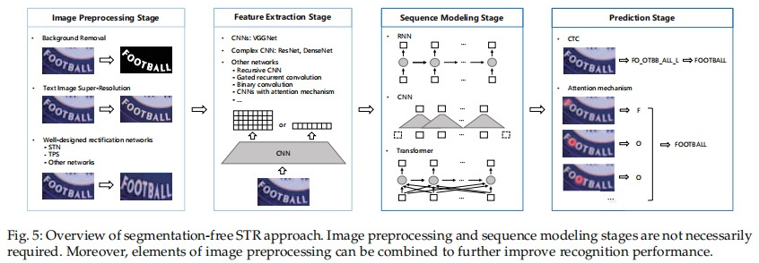

# Text Recognition in the Wild: A Survey

[1.识别方法](##1.识别方法)

[端到端的识别方法](#test)

## 1.识别方法

### 1.1 裁剪后的文本识别
有两种方法存在：基于分割的方法和无分割的方法。

**基于分割方法的步骤：**
1. 图像处理
2. 字符分割
3. 字符识别

基于分割的方法尝试定位每一个字符并用图像分类的方法来识别字符。其缺点：1.需要定位每个字符；
2.基于分割的识别器无法对单个字符之外的上下文信息进行建模。

**无分割的两种方法：**
* 基于CTC方法
* 基于attention的方法

无分割的方法是把整个文本行当做序列来处理。

**无分割方法步骤：**

* 图像预处理
  
  图像预处理旨在改善图像质量，可以提高特征提取和识别。
  * 背景移除
  * 文本图像超分
  * 修正
* 特征提取
  
  将视觉特征映射为字符相关的特征，忽略不相关的特征如，字体、颜色、大小、背景。一些论文
  认为结合CNN和RNN提取特征能更好的增强文字特征，抑制背景噪音。特征提取性能的提高是以计算量为代价的。
  因此背景移除和简单特征提取结合可能会是一个好方向。
* 序列建模
  
  序列建模是视觉特征和预测之间的桥梁，它可以获取上下文信息，这比单独预测单个字符更加有效。然而一些研究认为
  BiLSTM并不是STR不可或缺的一部分，因为它是计算密集型的结构比较耗时。而且训练过程可能会造成梯度消失或爆炸。
  因此滑动窗口或深层一维的CNN替代BiLSTM.还有用全局推理模块来捕获全局上下文信息方法。上下文线索有利于基于图像的序列识别。
  由于BiLSTM内在的缺陷，对比之下，CNN和transformer不仅能处理序列问题也能高效的并行计算，所以用CNN或transformer
  进行序列建模可能是一个新趋势。
* 预测

  Connectionist temporal classification (CTC) 和attention机制是两种主流的方法。
  * CTC
    
    然而一些方法认为CTC倾向于产生过拟合。[146]提出正则化来增强CTC的泛化能力，[196]通过融合focal loss 来解决数据不平衡的
    识别问题。[168]提高了CTC的精确度和鲁棒性通过用图网络（GCNs [197]）。CTC有着优秀的翻译性能，但也有以下缺点：
    * 对于长文本计算代价高
    * 尖峰分布问题[115]
    * CTC不能处理2维预测问题（如双层车牌号）[199]

  * 注意力机制方法
  
    attention机制在机器翻译领域被提出[98]，在自然场景文本识别中，注意力机制经常结合RNN作为预测模块。注意机制
    通过参考目标字符和所编码的特征向量的历史记录来学习输入实例图像和输出文本序列之间的对齐。目前已经有大量的方法
    在STR领域使用attention机制。而且，从不同的维度来改善普通的attention。
    * 应用于2D预测问题[137,154,159]
    * 改进隐藏的语言建模能力[151,148]
    * attention变体Transform[190]改善并行、减少计算量[149,156,163,170]
    * attention drift
    
    attention的缺点：
      * 计算量大，占用内存高
      * 对于长文本，由于对齐问题很难从头训练
      * 当前只涉及英语、法语少量语种，很少涉及中文。
  
  CTC和attention都有各自的优缺点，[168,169]结合两者获取了一个更高的精度，以及快速的推理。[214]实验表明，
  基于attention的方法在单个词语上可以获取更高的准确率，但在长句子上却不如CTC。因此正确的预测方法应该看具体的应用场景。
  [215]aggregation cross-entropy function来替换CTC和注意力机制，实现了相当的性能，而且速度更快，内存低，易部署。
  
### 1.2 端到端的识别方法
  端到端的方法兴起的原因有如下几点：
  * 分别进行检测、识别会积累误差
  * 端到端的方法，检测识别共享特征，联合优化可改善整体性能
  * 端到端系统更容易维护和适应新领域，而维护具有数据和模型依赖关系的级联管道则需要大量的工程工作。
  * 端到端系统推理速度更快，消耗内存低。

# test

