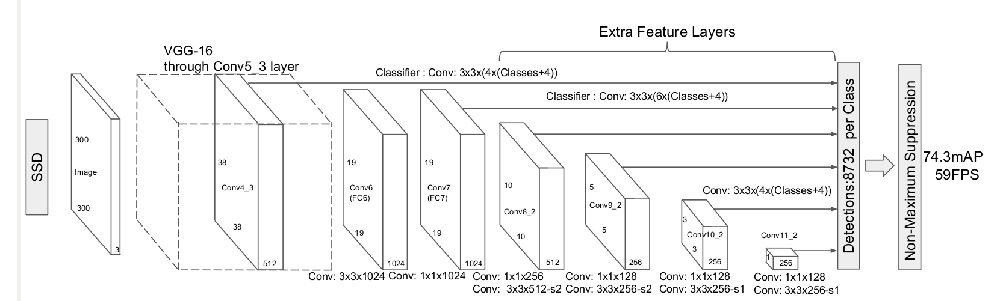
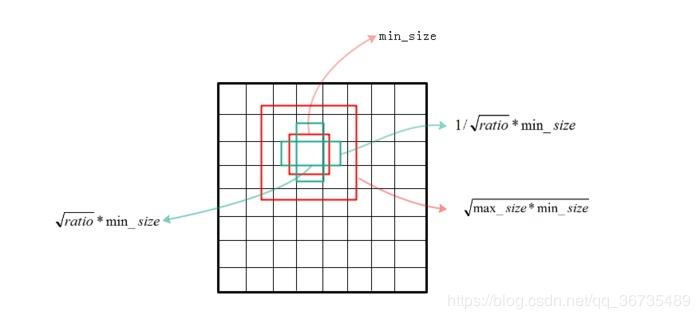

## SSD 结构


1. 每个default box 生成4个坐标值（x, y, w, h），以及21个类别confidence。feature map共有（4+c）*m*n*k个输出，
   k代表anchor/default box的数量
2. default box的数量一共是（38 * 38 * 4 + 19 * 19 * 6 + 10 * 10 * 6 + 5 * 5 * 6 + 3 * 3 * 4 + 1 * 1 * 4 = 8732
3. anchor大小的设置
   
    
    + Sk代表先验框大小相对于特征图的比例
    + Smin和Smax表示比例的最小值和最大值，论文中分别取0.2和0.9。m是特征图个数，这里为5，第一层单独设置Sk = Smin / 2 = 0.1。300 * 0.1 =30
      剩下的5层大小分别是60，111，162，213，264.
    + 有了Anchor的尺度，接下来设置Anchor的长宽
        + 共有5种aspect ratio，ar={1,2,3,1/2,1/3} 为1时还会设置另一种s′k=√（sk * sk+1），理论上每个特征图会有6个anchor
          但第一层和后两层去掉了3，1/3的宽比，为4个anchor其余为6个。
        + 最后一个特征图需要参考一下sk+1 = 315来计算s′k。
        + 宽高的计算公式如下：<br>
            
          ```python
            anchor_sizes=[(30., 60.),
                           (60., 111.),
                           (111., 162.),
                           (162., 213.),
                           (213., 264.),
                           (264., 315.)]
          ```
          每个anchor的长宽计算如下图：
    
          
## mobileSSD 人脸检测结构
1. 输入 240 * 320，min_boxes = [[10, 16], [24, 32, 48], [64, 96, 128], [192, 256]]  原始ssd有6个分支做预测，这里只采用了4个分支做预测。每一个分支的基础anchor分别为3个，2个，2个，3个。
    中间多两头少。
2. 30 * 40 * 2 + 15 * 20 * 3 + 8 * 10 * 3 + 4 * 5 * 2 = 3580