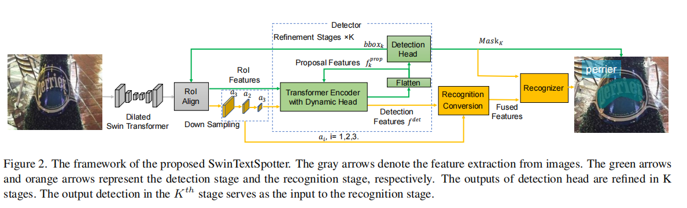

## 摘要
最近的文字识别方法通常只通过共享主干来合并检测和识别，这并没有直接利用两个任务之间的特征交互。
本文我们提出SwinTextSpotter,用transformer编码来作为检测器。我们用一种新的识别转换机制来统一这两个任务，通过识别损失来明确地引导文本定位。
简单的设计产生了一个简洁的框架，既不需要额外的修正模块，也不需要对任意形状的文本进行字符级标注。

## 引言
1. 先检测再识别的缺点
    + 误差累计
    + 两个任务不能最大化性能，计算量大，效率低下
2. 端到端的识别方法
   
    + 优点：识别器可以改善检测器的性能，同样的即使检测器不准确，识别器也可以通过大的感受野进行正确的预测。
    + 缺点：1.如果检测是简单地基于输入特征中的视觉信息，则检测器容易被背景噪声影响，并导致不一致的检测。2.通过共享主干，检测和识别之间的相互作用是不够的，因为检测器既没有优化识别损失，识别器也没有利用检测特征。

   针对问题一,同一图像中文本之间的交互作用是消除背景噪声影响的关键因素，因为同一单词的不同字符可能包含很强的相似性，
   因此用Transformer可以很好的学习文本实例之间的交互。
   针对问题二，为了充分联合利用检测和识别，Mask TextSpotter利用语义分割，ABCNet v2用自适应训练策略
   通过检测结果来提取识别特征；ARTS通过从识别到检测反向传播损失来改善性能。
   然而，这三种方法都假设检测器在结构上提取了文本特征，例如在阅读顺序上。文本识别的整体性能受到检测器的限制。

因此我们提出了SwinTextSpotter，迈向文本检测和识别之间更好的协同作用。为了更好地区分拥挤场景中密集分散的文本实例，
我们用Transformer和双层的self-attention 促进文本实例之间的交互。为了解决任意形状的文本识别，
我们将文本检测任务视为一个set-prediction问题，因此采用了基于查询的文本检测器。我们进一步提出了识别转换(RC)，它通过结合检测特征来隐式地引导识别。
RC可以将识别信息反向传播到检测器，并抑制识别特征中的背景噪声，由于RC的引入，SwinTextSpotter是一个简洁的结构。
