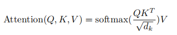
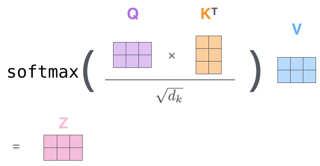
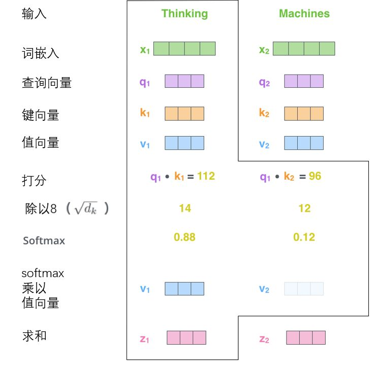
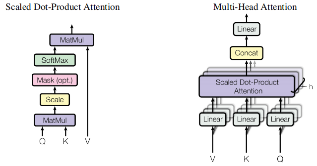
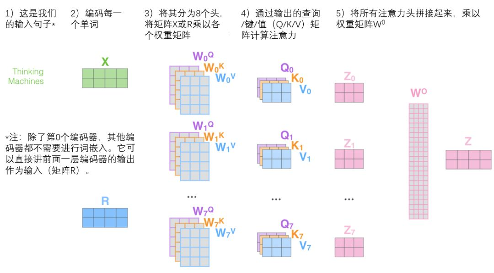
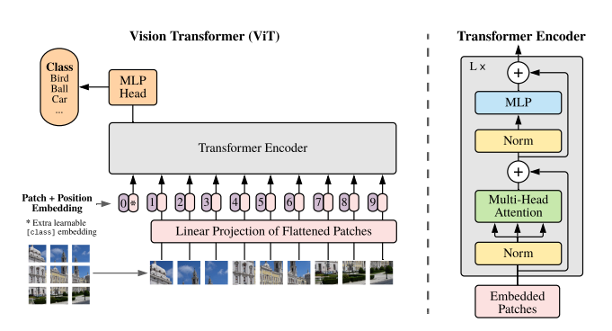
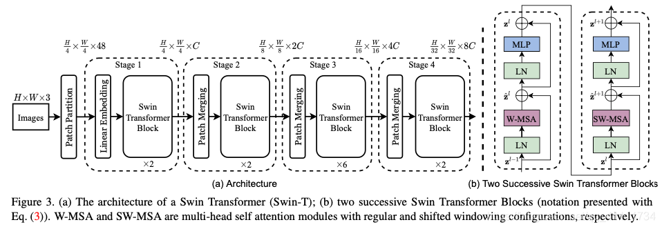
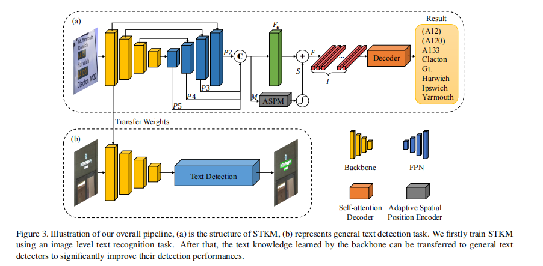

## Transformer
[解释参考](https://jalammar.github.io/illustrated-transformer/)
[代码解析](https://mp.weixin.qq.com/s?__biz=MzI1MjQ2OTQ3Ng==&mid=2247587454&idx=1&sn=6d12eb9f50d2c830f1cc6a0ceb9d9c05&chksm=e9e09ff5de9716e3b599b1fe4846fd8b167048ec4f64d96b555abe8b26faeb2c2e8679a30fdd&scene=27)
1. Q K V 的理解，一个词向量（512维）可以分解为Q K V三个向量（64维）
   
   
   
   
   最后 z = 0.88 * v1 + 0.12 * v2
2. Muti-head的计算
   
   
   
   每个此词向量与不同的权重矩阵相乘得到多组QKV向量。其好处：
    + 得到多个表示子空间
    + 扩展了模型专注于不同位置的能力
    + 可以类似于 CNN 中利用多个卷积核分别提取不同特征
   
3. 位置编码表示序列顺序

4. 自注意力的计算步骤
   + 得到QKV向量： X1与WQ、WK、WV矩阵相乘得到q1,k1,v1
   + 打分：当前单词的查询向量与每个单词的键向量点积来计算
   + 除以8(8是论文中使用的键向量的维数64的平方根，这会让梯度更稳定。这里也可以使用其它值，8只是默认值)
   + 计算softmax，该分数决定了每个单词对编码当下位置（“Thinking”）的贡献(若是解码，在此步骤之前会有mask操作，只允许关注输出序列中的较早位置)
   + 每个值向量乘以softmax分数
   + 对加权值向量求和

## Vision Transform (VIT)
实现步骤： 

1. 图片分块 224 * 224 -->  16 * 16 * 196
2. patch 转化为 embedding  （196 + 1） * 768  1是加了分类
3. 加入位置编码   是一个768的向量与embedding 加和 变为 197 * 768  （随机设置，通过训练获得）
4. transform处理  多层叠加处理仍然输出 197 * 768
5. 分类处理(两种⽅式，⼀种是使⽤CLS token，另⼀种就是对所有tokens的输出做⼀个平均)。这里在patch 那个维度加入了一个cls_token，可以这样理解这个存在，其他的embedding表达的都是不同的patch的特征，而cls_token是要综合所有patch的信息，产生一个新的embedding，来表达整个图的信息。而dist_token则是属于DeiT网络的结构。

VIT 与 Resnet的差异：两个网络在整合全局信息的能力上存在差异。
1. VIT无论是高层还是低层都是局部和全局信息混杂的。
2. Resnet 更为严格的遵守从局部特征提取到全局特征的过程。

VIT 代码实现：https://github.com/FrancescoSaverioZuppichini/ViT

## [Swin Transformer](https://arxiv.org/pdf/2103.14030.pdf)
[源码](https://github.com/microsoft/Swin-Transformer)

主要组成部分：
1. Patch Embedding
   + 切块输入 （N，56*56，96）
2. Patch Merging
   + 借鉴CNN思想 降采样，缩小特征图分辨率
   + 在行方向和列方向上，间隔2选取元素。 然后拼接在一起作为一整个张量，最后展开。此时通道维度会变成原先的4倍（因为H,W各缩小2倍），此时再通过一个全连接层再调整通道维度为原来的两倍。
3. Window Partition/Reverse
4. Window Attention

## Self-attention based Text Knowledge Mining for Text Detection（STKM)

文章的动机：
在Imagenet以及SynthText数据集上预训练，与实际应用的数据集是有gap的。
网络处理步骤：
1. CNN+FPN拿融合特征
2. ASPM获取位置空间信息特征
3. Self-attention Decoder 解码特征F为文本序列