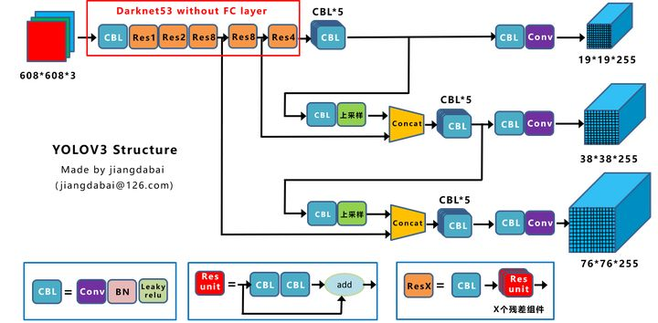
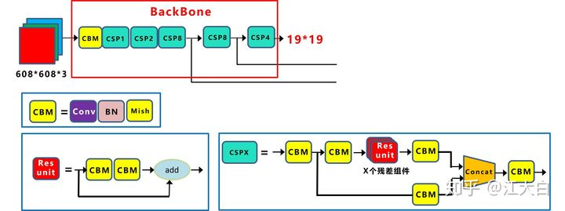
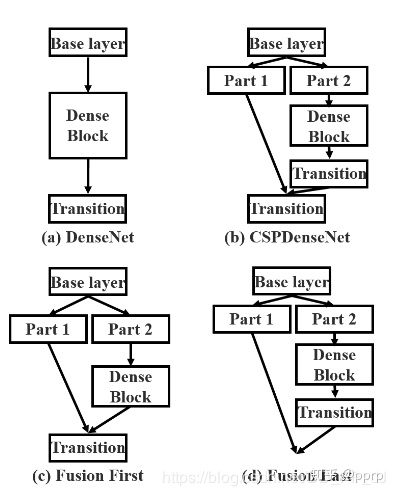
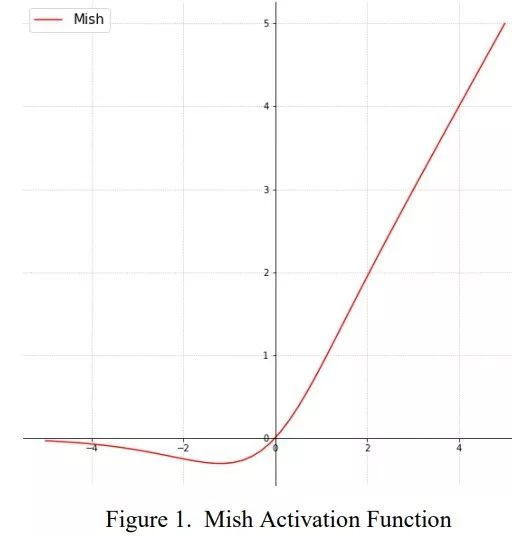
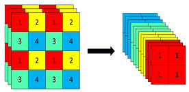
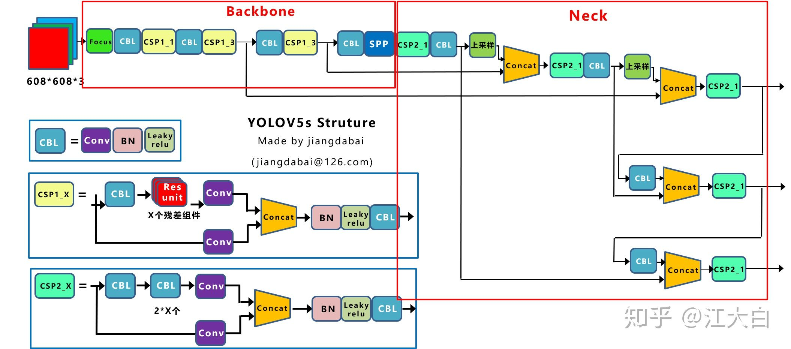

## YOLOv1
1. 7 * 7 的网格，每个网格预测两个框，共98个框。输出 7 * 7 * (5*b+c)，b是(x, y, w, h)和confidence共5个值，confidence是物体的概率乘以IOU，c是类别数目。
   class信息是针对每个网格的，confidence信息是针对每个bounding box的
2. 损失全是回归，预测框位置损失 + 含有物体box的概率 + 某一物体的概率
3. 优点
 + 背景误检率低
 + 通用性强
4. 缺点
 + 由于使用全连接，只能检测固定尺寸图像
 + 一个格只能检测一个物体
 + 大小物体IOU误差贡献接近，小物体IOU误差造成很大的影响。降低定位的准确性。

## YOLOv2

1. BN  每个卷积层后都加入BN，并不再使用dropout，提升4.2个点
2. 使用ImageNet的高分辨率输入做预训练（原来224，然后使用448）
3. 使用anchor
4. 先验框的设置使用k-mean分类来分析
5. 新的骨架网络DrakNet19
6. 直接位置预测
7. 多尺度预测，把大特征图拆分成小特征图后，与后面的拼接然后预测
8. 多尺度训练，训练过程中会变化输入尺寸

## YOLOv3
改造网络由Darknet19->Darknet53

1. 丢掉池化以及全连接
2. 借鉴FPN
3. 借鉴restnet,densenet
4. 残差连接时使用add而不是concat

## YoloV4

1. Darknet53 -> CSPDarknet53  借鉴CSPNet,(Cross-stage partial connections)
   
2. 数据增强cutout，gridMask
3. 正则化Dropout、Dropblock
4. 增大感受野：SPP、ASPP、RFB
5. FPN的改进方式：
   + ASFF 对融合的不同层加上权重
     
   + BiFPN 对PANnet融合的连接方式改造，移除p3和p7的节点，并进行跳跃连接，同时对融合层尝试了不同的权重策略
     
6. SE模块：添加一个注意力分支，输出1*1*C的一维权重，来区分不同通道的重要程度。
7. NMS 改进
    + soft NMS  重合度高的框不直接过滤掉，而是重新赋值一个较低的分数
    + DIOU NMS  IOU - DIOU 小于某个值，保留重叠框。  DIOU = 中心点距离 / （最小矩形对角线长度）
    
8. BN的改进FRN 对于batchsize不再敏感
9. 注意力机制 CBAM 基于通道注意力和空间注意力
10. 数据增强Mosaic 4张图片拼成一个
11. CSP 降低计算量，轻量化的同时保持精度
    
    + a图是原始的DenseNet的特征融合方式
    + b图是CSPDenseNet的特征融合方式（trainsition->concatenation->transition）
    + c图是Fusion First的特征融合方式（concatenation->transition）
    + d图是Fusion Last的特征融合方式（transition->concatenation）
    
    Fustion First的方式是对两个分支的feature map先进行concatenation操作，这样梯度信息可以被重用。
同时使用Fusion First和Fusion Last的CSP所采用的融合方式可以在降低计算代价的同时，提升准确率。

Fusion Last的方式是对Dense Block所在分支先进性transition操作，然后再进行concatenation， 梯度信息将被截断，因此不会重复使用梯度信息 。
12. 激活函数改进  Mish=x * tanh(ln(1+e^x))。
    
## YOLOv5
1. Fcous结构：
   将RGB三通道图片进行邻近采样得到分辨率减半的12通道特征图,在不损失信息的情况下，特征图通道增加，该操作是为了提速。
   
2. yolov5 两种CSP结构  CSP1_X结构应用于Backbone主干网络，另一种CSP2_X结构则应用于Neck中
    