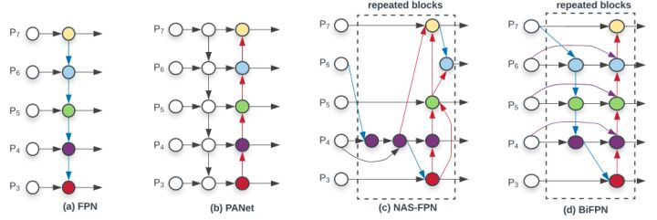

## YOLOv1
1. 7 * 7 的网格，每个网格预测两个框，共98个框。输出 7 * 7 * (5*b+c)，b是(x, y, w, h)和confidence共5个值，confidence是物体的概率乘以IOU，c是类别数目。
   class信息是针对每个网格的，confidence信息是针对每个bounding box的
2. 损失全是回归，预测框位置损失 + 含有物体box的概率 + 某一物体的概率
3. 优点
 + 背景误检率低
 + 通用性强
4. 缺点
 + 由于使用全连接，只能检测固定尺寸图像
 + 一个格只能检测一个物体
 + 大小物体IOU误差贡献接近，小物体IOU误差造成很大的影响。降低定位的准确性。

## YOLOv2

1. BN  每个卷积层后都加入BN，并不再使用dropout，提升4.2个点
2. 使用ImageNet的高分辨率输入做预训练（原来224，然后使用448）
3. 使用anchor
4. 先验框的设置使用k-mean分类来分析
5. 新的骨架网络DrakNet19
6. 直接位置预测
7. 多尺度预测，把大特征图拆分成小特征图后，与后面的拼接然后预测
8. 多尺度训练，训练过程中会变化输入尺寸

## YOLOv3
改造网络由Darknet19->Darknet53

1. 丢掉池化以及全连接
2. 借鉴FPN
3. 借鉴restnet,densenet
4. 残差连接时使用add而不是concat

## YoloV4

1. Darknet53 -> CSPDarknet53
2. 数据增强cutout，gridMask
3. 正则化Dropout、Dropblock
4. 增大感受野：SPP、ASPP、RFB
5. FPN的改进方式：
   + ASFF 对融合的不同层加上权重
     
   + BiFPN 对PANnet融合的连接方式改造，移除p3和p7的节点，并进行跳跃连接，同时对融合层尝试了不同的权重策略
     
